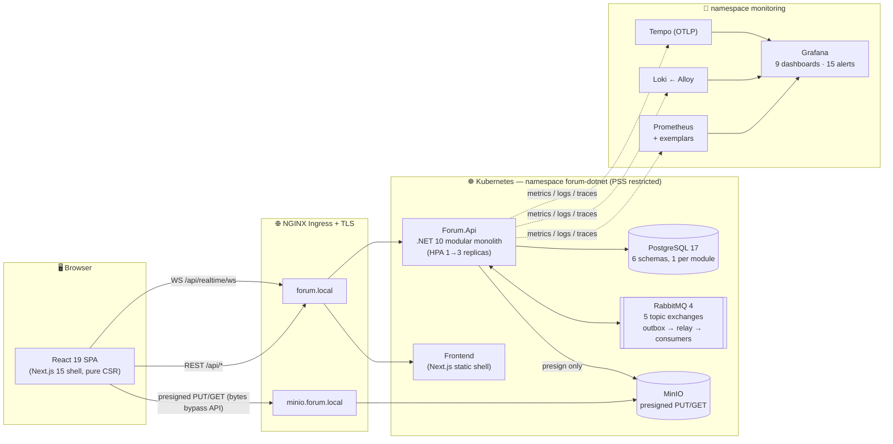
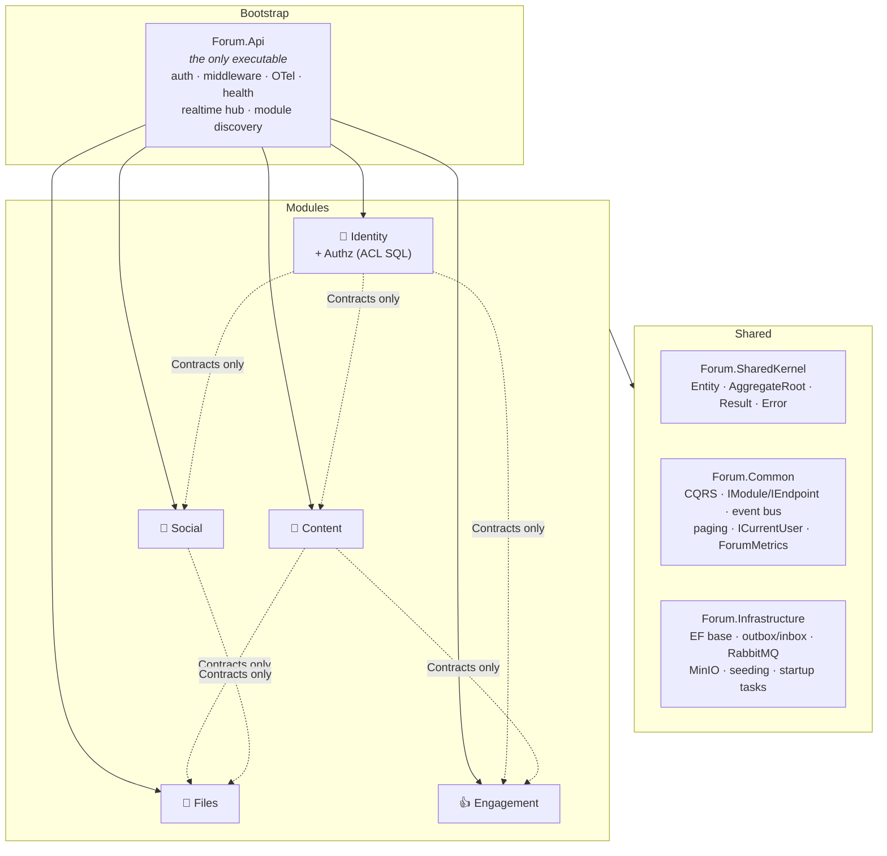
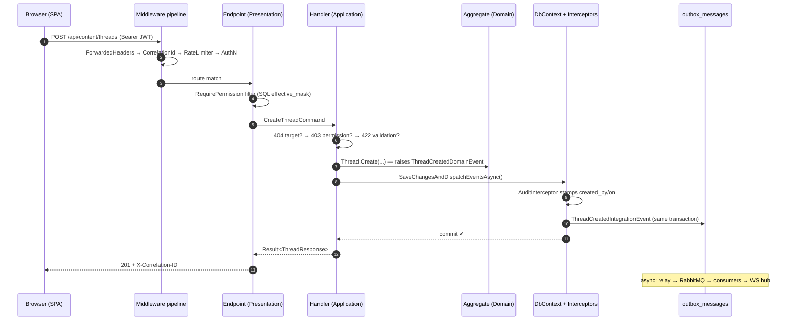
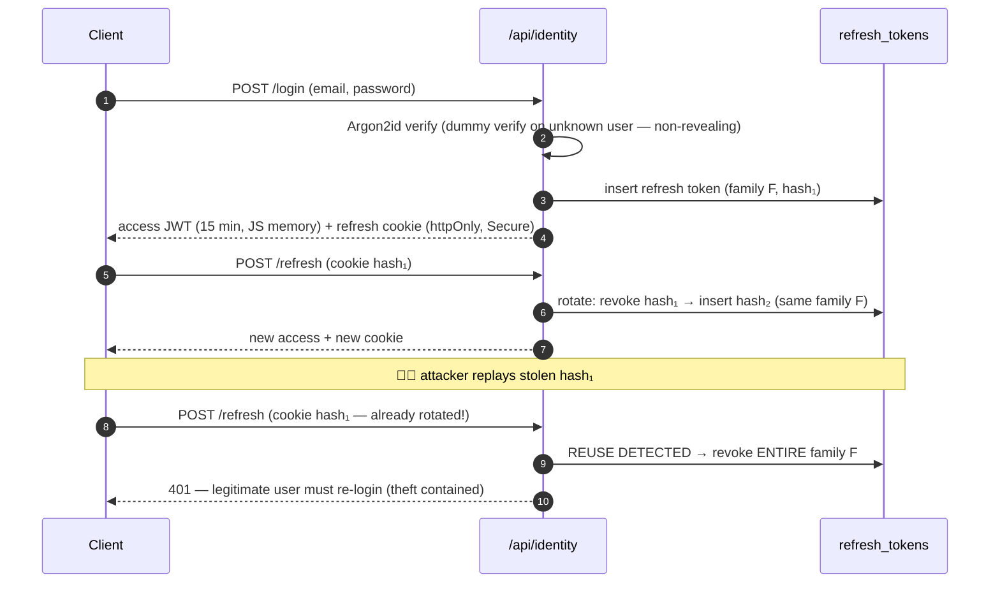
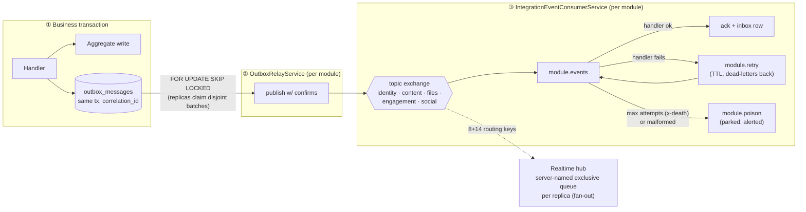
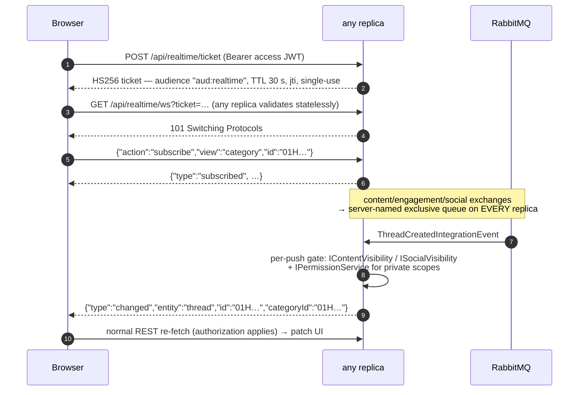
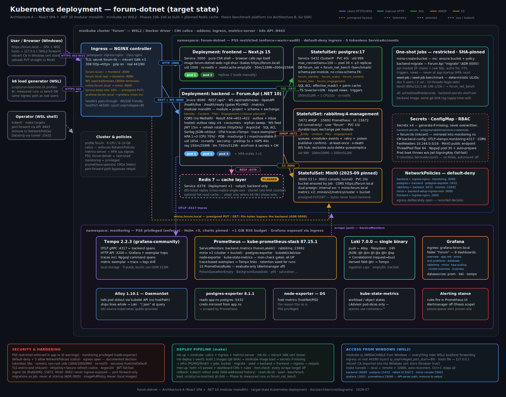
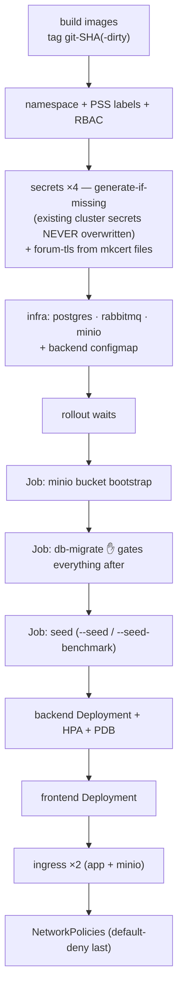

<div align="center">

# 🧵 forum-dotnet — Enterprise-Grade Forum Platform

**A deliberately over-engineered, production-grade forum built as a module-first .NET 10 modular monolith with a decoupled React SPA — deployed on hardened Kubernetes with a full CNCF observability stack and a reproducible benchmark harness.**

.NET 10 · ASP.NET Core Minimal APIs · PostgreSQL 17 · RabbitMQ 4 · MinIO · Next.js 15 / React 19 · Kubernetes (minikube + Calico) · Prometheus / Grafana / Loki / Tempo · k6

<br/>

*Architecture A of the master's thesis:*
***"Unified full-stack monoliths vs. decoupled tiered architectures: a quantitative analysis of performance and developer-experience trade-offs in cross-platform applications"***

<br/>

<!-- ───────────── CI / quality · live GitHub Actions status ───────────── -->
[](https://github.com/JakubPatkowski/Forum-Master-Thesis-.NET/actions/workflows/ci.yml)
[](https://github.com/JakubPatkowski/Forum-Master-Thesis-.NET/actions/workflows/security.yml)


<!-- TODO: add Codecov badge once coverage upload is wired into ci.yml:
[](https://codecov.io/gh/JakubPatkowski/Forum-Master-Thesis-.NET) -->

<!-- ───────────── Backend stack ───────────── -->


<!-- ───────────── Frontend & infrastructure ───────────── -->


<!-- ───────────── Observability & testing ───────────── -->


</div>

---

## 📋 Table of Contents

- [About the Project](#-about-the-project)
- [Engineering Highlights](#-engineering-highlights)
- [By the Numbers](#-by-the-numbers)
- [Screenshots](#-screenshots)
- [Features](#-features)
  - [Identity & Authorization](#-identity--authorization-identity-module)
  - [Content](#-content-content-module)
  - [Files](#-files-files-module)
  - [Engagement](#-engagement-engagement-module)
  - [Social](#-social-social-module)
  - [Real-Time](#-real-time-websocket-hub)
- [Architecture](#-architecture)
  - [System Overview](#system-overview)
  - [Module-First Modular Monolith](#module-first-modular-monolith)
  - [In-Module Hexagonal Layering](#in-module-hexagonal-layering)
  - [CQRS Without MediatR](#cqrs-without-mediatr)
  - [Result Pattern & Error Precedence](#result-pattern--error-precedence)
  - [Request Lifecycle](#request-lifecycle)
  - [Eventing Model](#eventing-model-domain-events-vs-integration-events)
  - [Architecture Decision Records](#architecture-decision-records-adr)
- [Tech Stack](#-tech-stack)
- [Database Design](#-database-design)
  - [Schema-per-Module](#schema-per-module)
  - [Table Catalog](#table-catalog)
  - [RBAC + Bitmask ACL in SQL](#rbac--bitmask-acl-resolved-in-sql)
  - [Read Models: Views, FTS, Keyset Pagination](#read-models-views-full-text-search-keyset-pagination)
  - [Migration Strategy](#migration-strategy)
- [Backend Deep Dive](#-backend-deep-dive)
  - [Solution Topology](#solution-topology-18-projects)
  - [Shared Building Blocks](#shared-building-blocks)
  - [Module: Identity](#module-identity)
  - [Module: Content](#module-content)
  - [Module: Files](#module-files)
  - [Module: Engagement](#module-engagement)
  - [Module: Social](#module-social)
  - [Messaging Backbone](#messaging-backbone-transactional-outbox--rabbitmq--inbox)
  - [Real-Time WebSocket Hub](#real-time-websocket-hub)
  - [Observability Implementation](#observability-implementation)
  - [Deterministic Seeding](#deterministic-seeding)
  - [Error Handling & Resilience](#error-handling--resilience)
  - [Performance Engineering](#performance-engineering)
- [Design Patterns & Practices Catalog](#-design-patterns--practices-catalog)
- [Frontend Deep Dive](#-frontend-deep-dive)
- [API Overview](#-api-overview)
- [Security](#-security)
- [Kubernetes Deep Dive](#-kubernetes-deep-dive)
  - [Cluster Shape](#cluster-shape)
  - [Workload Hardening Catalog](#workload-hardening-catalog)
  - [Jobs: Migrations, Seeding, Bucket Bootstrap](#jobs-migrations-seeding-bucket-bootstrap)
  - [Networking: Ingress, TLS, NetworkPolicies](#networking-ingress-tls-networkpolicies)
  - [Autoscaling: HPA War Stories](#autoscaling-hpa-war-stories)
  - [Deployment Pipeline](#deployment-pipeline)
  - [WSL2 / Windows Access Architecture](#wsl2--windows-access-architecture)
  - [Monitoring Stack](#monitoring-stack-helm-pinned)
- [Operational Runbook Quick Reference](#-operational-runbook-quick-reference)
- [Load Testing & Benchmarks](#-load-testing--benchmarks)
- [Testing & Quality Gates](#-testing--quality-gates)
- [CI/CD Pipeline](#-cicd-pipeline)
- [Getting Started](#-getting-started)
- [Development Workflow & Conventions](#-development-workflow--conventions)
- [Configuration](#-configuration)
- [Project Structure](#-project-structure)
- [Useful Commands](#-useful-commands)
- [Roadmap](#-roadmap)
- [Design Q&A — Why X and Not Y](#-design-qa--why-x-and-not-y)
- [Documentation](#-documentation)
- [Thesis Context: Architecture A vs B](#-thesis-context-architecture-a-vs-b)
- [Glossary](#-glossary)
- [Authors](#-authors)
- [License](#-license)

---

## 🎓 About the Project

**forum-dotnet** is the complete implementation of **Architecture A** in a two-architecture master's thesis experiment. Two independent teams build the *same* forum product under one shared functional contract, using radically different architectural philosophies, and then benchmark them head-to-head:

| | **Architecture A — this repository** | **Architecture B — [`gomx`] (colleague's repo)** |
|---|---|---|
| **Style** | Decoupled tiers: SPA ⇄ REST API | Unified SSR monolith |
| **Backend** | .NET 10 modular monolith (module-first, CQRS, outbox) | Go + Templ server-side rendering |
| **Frontend** | React 19 / Next.js 15, pure CSR, TanStack Query | HTMX + Alpine.js over SSR HTML |
| **Real-time** | WebSocket change-notifications, fetch-then-patch | SSE / HTMX partial swaps |
| **Data** | PostgreSQL 17 + RabbitMQ + MinIO | PostgreSQL + Redis + MinIO |
| **Benchmark role** | The "enterprise-decomposed" contender | The "radically-simple" contender |

The goal of *this* codebase goes beyond "a working forum" — it is **deliberately, professionally over-engineered** to showcase how a serious production system is built end to end:

- **Module-first modular monolith** with compiler- and test-enforced boundaries — five business modules that share *no* types except explicit `Contracts`, communicate only via integration events, and each own their private database schema.
- **A complete asynchronous integration pipeline**: transactional outbox → RabbitMQ topic exchanges with publisher confirms → competing consumers with inbox-based idempotency, retry and poison queues — all hand-built on `RabbitMQ.Client`, no MassTransit/NServiceBus.
- **Real-time UX** over raw WebSockets with per-push authorization, replica-safe fan-out and a single-use ticket handshake.
- **Security as a first-class requirement**: Argon2id, JWT refresh rotation with family reuse-detection, RBAC + bitmask ACL resolved *inside PostgreSQL*, Pod Security Standards `restricted`, default-deny NetworkPolicies.
- **Observability as a verified contract**: metrics, logs and traces correlate end-to-end (response header → log line → trace → exemplar), with the exported names pinned by automated tests.
- **Thesis-grade reproducibility**: deterministic ULID-addressed seed profiles, pinned Helm charts, archived k6 benchmark bundles with git SHA + image digest + dataset fingerprint.

> **Authors:** Jakub Patkowski (95818) & Hubert Ożarowski (97692) · **Supervisor:** Dr inż. Kamil Żyła
> The shared A/B functional contract lives in [`docs/specs/forum-spec.md`](docs/specs/forum-spec.md).

---

## 🏆 Engineering Highlights

The ten locked architectural assumptions (full rationale in [`REQUIREMENTS-AND-ASSUMPTIONS.md`](docs/architecture/REQUIREMENTS-AND-ASSUMPTIONS.md)):

1. 🗄️ **Professional relational schema** — RBAC **and** bitmask ACL, ownership, soft-delete, full audit columns on every aggregate root.
2. 🔑 **ULID everywhere** — no integers or GUIDv4 in URLs; sortable, opaque, deterministic in seeds.
3. 🔒 **Argon2id** password hashing (no bcrypt/PBKDF2 compromises).
4. 📦 **Direct-to-MinIO presigned uploads** — file bytes *never* pass through the backend.
5. 🧩 **Module-first monolith + RabbitMQ integration events** via transactional outbox — zero cross-module type or schema coupling.
6. ⚡ **WebSocket change-notifications** — the SPA re-fetches and patches in place ("fetch-then-patch"), never trusts pushed payloads as state.
7. 🔭 **Full observability** — Serilog → Loki, OpenTelemetry traces → Tempo, metrics + exemplars → Prometheus → Grafana; `/health/live` + `/health/ready`.
8. ⚖️ **Functional scope = the golden mean** — big enough to be a real product, small enough to finish twice (A and B).
9. 📖 **Reads via SQL views + keyset pagination; writes via aggregates + UnitOfWork**; Result pattern; strict **404 → 403 → 422** error precedence.
10. 🚀 **Migrations as a Kubernetes Job** — never at app startup (HPA replica races).

Plus the things that only show up when you actually run it in anger:

- 🐛 **Real production-class bugs found & regression-tested**: the exception-path correlation-ID loss, kubelet's 1-second default probe timeout silently freezing HPA scale-up, Completed Job pods poisoning the HPA metric pool, a stalled WebSocket peer head-of-line-blocking a whole replica, `.NET` BackgroundServices dying silently on broker timeouts.
- 📊 **Measured, archived results**: demo profile sustains **~113 req/s with p95 ≈ 35 ms at 80 VUs and 0.00% errors** while the HPA walks 1→2→3 replicas ([details](#-load-testing--benchmarks)).
- 🧪 **278 automated tests** including full-pipeline E2E over real Postgres, RabbitMQ and MinIO via Testcontainers — REST call → outbox → broker → consumer → WebSocket push asserted in one test.

---

## 🔢 By the Numbers

| Metric | Value |
|---|---:|
| Backend C# source files / lines | **588 files · ~31,000 LOC** |
| Backend test files / lines | 107 files · ~7,300 LOC |
| Frontend TS/TSX/CSS files / lines | 99 files · ~9,800 LOC |
| Solution projects | **18** (9 source + 9 test) |
| Business modules | **5** (Identity, Content, Files, Engagement, Social) |
| HTTP endpoints (1 file = 1 endpoint) | **80+** minimal-API endpoints + WebSocket hub |
| CQRS command/query handlers | **167** |
| Database schemas | **6** (`forum_identity`, `forum_authz`, `forum_content`, `forum_files`, `forum_engagement`, `forum_social`) |
| SQL read views | **13** |
| EF migrations (incl. raw-SQL: ACL functions, FTS triggers, counters, views) | 13 chains across 5 modules |
| Automated tests | **238 backend + 40 frontend = 278** |
| Grafana dashboards / provisioned queries | **9 dashboards · 86 queries** (all live-verified) |
| Prometheus alert rules | **15** |
| Architecture Decision Records | **11** |
| Kubernetes manifests / deploy & ops scripts | ~1,300 lines YAML · ~1,600 lines bash |
| Architecture & ops documentation | **~7,900 lines** of Markdown in [`docs/`](docs/) |
| Benchmark dataset (deterministic seed) | 800 users · 1,600 threads · 9,000 comments · 15,000 reactions |

---

## 📸 Screenshots

> Screenshots live under [`docs/screenshoots/`](docs/screenshoots). The Grafana/HPA captures below are real; the remaining slots are placeholders — drop the PNGs in and they will light up.

| Home feed (merged keyset feeds + LIVE banner) | Thread view (comment tree, TOC, attachments) |
|:---:|:---:|
| <!-- TODO: docs/screenshoots/home.png --> `[PLACEHOLDER: home.png]` | <!-- TODO: docs/screenshoots/thread.png --> `[PLACEHOLDER: thread.png]` |
| **Markdown editor (WRITE/PREVIEW + inline upload)** | **Social hub (friends · DMs · groups)** |
| <!-- TODO: docs/screenshoots/editor.png --> `[PLACEHOLDER: editor.png]` | <!-- TODO: docs/screenshoots/social.png --> `[PLACEHOLDER: social.png]` |
| **Realtime: live notifications & presence** | **`/dev/monitor` — live bus + WS hub tap** |
| <!-- TODO: docs/screenshoots/realtime.png --> `[PLACEHOLDER: realtime.png]` | <!-- TODO: docs/screenshoots/dev-monitor.png --> `[PLACEHOLDER: dev-monitor.png]` |
| **Grafana — HPA scaling under k6 load** | **Grafana — cluster view during scale-out** |
|  |  |
| **Grafana — RED / overview dashboard** | **Tempo — trace with exemplar jump from Prometheus** |
| <!-- TODO: docs/screenshoots/grafana-red.png --> `[PLACEHOLDER: grafana-red.png]` | <!-- TODO: docs/screenshoots/tempo-exemplar.png --> `[PLACEHOLDER: tempo-exemplar.png]` |
| **Swagger UI (Development)** | **k6 benchmark run (`make bench`)** |
| <!-- TODO: docs/screenshoots/swagger.png --> `[PLACEHOLDER: swagger.png]` | <!-- TODO: docs/screenshoots/k6-bench.png --> `[PLACEHOLDER: k6-bench.png]` |

---

## ✨ Features

### 🔐 Identity & Authorization (`Identity` module)

- Registration with validation; **Argon2id** password hashing (Isopoh, RFC 9106 profile).
- **JWT login**: 15-minute access token (kept in JS memory only) + 14-day refresh token in an **httpOnly, Secure cookie**.
- **Refresh-token rotation with family reuse-detection** — re-presenting a rotated token is treated as theft and revokes the entire token family (SHA-256-hashed chain in `refresh_tokens`).
- Non-revealing login (dummy Argon2 verify on unknown users — constant-shape response for wrong-user vs wrong-password vs blocked).
- Logout (current device) and logout-all (whole family).
- **RBAC + bitmask ACL**: global roles `user < moderator < admin` plus per-context roles and per-user permission bits scoped to a category or group — resolved **inside PostgreSQL** ([details](#rbac--bitmask-acl-resolved-in-sql)).
- Admin surface: list users, assign roles, edit ACL entries, block/unblock accounts (blocking cascades over the bus: pending friend requests and group invites are dropped module-side).

### 📝 Content (`Content` module)

- **Categories** (public/private, slug-addressed, owned, soft-deleted, icon via Files module).
- **Threads**: raw Markdown bodies, tags (get-or-create), pinning, category moves; keyset-friendly feed index `(category_id, is_pinned DESC, created_on_utc DESC, id DESC)`.
- **Nested comments** via **materialized path** (`path` ≤ 161 chars, depth cap 5) — an entire tree loads in one indexed query; deletion tombstones the body to `"[deleted]"` and keeps children.
- **Full-text search** on a trigger-maintained `tsvector` (title weight A, body weight B, GIN index) queried with `websearch_to_tsquery` — robust against raw user input, no `ILIKE` anywhere.
- **Keyset (cursor) pagination everywhere** — Base64Url-encoded opaque cursors, no `OFFSET` in the codebase; the search cursor even carries `ts_rank` for stable relevance paging.
- Moderation: pin, delete, move — gated by the `moderate` permission bit resolved *at category scope* (covers both global moderators and per-category grants).

### 📁 Files (`Files` module)

- **Direct-to-MinIO presigned uploads** (ADR 0008): `POST /api/files` validates declared type/size against an allow-list, creates a `pending` row with a ULID-month-sharded object key (`yyyy/MM/{ulid}`), and returns a presigned PUT URL — **upload bytes never touch the backend**.
- **Commit step re-verifies reality**: the backend stats the real object size, sniffs the true content type from **magic bytes**, and decodes image dimensions with a hand-rolled `ImageProbe` (PNG/JPEG/GIF/WebP header parsers — no ImageSharp licensing). Declared values are never trusted.
- Attachments link a file to exactly one target `(target_type, target_id)`: thread, comment, avatar, category icon, chat message, group icon — with replace semantics for avatars/icons and an additive cap for posts.
- **Cross-module authorization without circular references**: Files asks Content (`IContentAuthorization`) and Social (`ISocialAuthorization`) via their Contracts to authorize attach/detach/read — the dependency graph stays acyclic (`Identity ← Content ← Files`, `Identity ← Social ← Files`).
- **Orphan sweeper**: a `BackgroundService` with a Postgres **session advisory lock** for cross-replica dedupe removes abandoned pending uploads and unattached committed files (blob-then-row, both idempotent), emitting `FileOrphaned` events.
- Message-attached files are **read-gated to conversation participants** — presigned GETs for private content require an active seat in the conversation.

### 👍 Engagement (`Engagement` module)

- **Idempotent like toggles** on threads and comments — re-like and un-like-never-liked are 200 no-ops returning the current `{count, viewerReacted}`.
- The reactions PK `(user_id, target_type, target_id, reaction_type)` plus a signed `value` column deliberately leaves room for multi-kind reactions and down-votes without a migration.
- **Trigger-maintained counter table** — `reaction_counts` lives *outside* the EF model and is folded exclusively by an `AFTER INSERT OR DELETE` row trigger, so no code path (toggle, cascade consumer, seeding) can ever drift it.
- Batch summary endpoint (≤ 100 targets, one two-resultset round-trip) powering the SPA's like hydration.
- **`user_stats_v`**: live thread/comment counts + karma (`SUM(value)` over reactions on the user's live content) as a cross-schema read-only view.

### 👥 Social (`Social` module)

- **Friendships** with a pending → accepted lifecycle; decline/cancel/unfriend physically delete the row; a raw-SQL `LEAST/GREATEST` unique index kills the A→B/B→A race.
- **Peer blocks** — distinct from admin bans; blocks sever friendships and pending invites in-transaction, and every block/privacy denial returns **one indistinguishable generic 403**, so a block never reveals itself.
- **Groups**: public (open join) / private (invite-only); visibility affects *discovery only* — chat and roster are member-only either way. The owner can never leave or be kicked (transfer or delete). **Group-admin is not a column** — it is the existing `moderate` ACL bit granted at *group scope*, reusing the whole permission machinery with **zero new bits and zero schema changes**.
- **Unified messaging**: DMs and group chats share one `conversations`/`messages` model — a group chat's conversation id *is* the group id; `conversation_participants` is the single message-authorization fact, kept in sync in-transaction when membership changes.
- Message editing with marker, `"[deleted]"` tombstones, 4,000-char Markdown bodies, per-seat unread markers (own badge only — no sender-visible read receipts by design).
- **Durable notifications** (friend requests/accepts, group invites/kicks) as bell-truth rows + real-time pushes; **presence** via heartbeat with status computed from age at read time.
- **Privacy settings** per interaction kind (everyone / friends / no-one) enforced in a shared `SocialInteractionGate` on *every* send, not just on connect.

### ⚡ Real-Time (WebSocket hub)

- `POST /api/realtime/ticket` + `GET /api/realtime/ws` — a **short-lived (30 s), single-use, audience-scoped JWT ticket** solves "browsers can't send Authorization headers on WS" without leaking access tokens into URLs; any replica can validate it statelessly.
- Subscription views: `category`, `thread`, `user` (self-only), `group`, `conversation` — **subscribe is always accepted, authorization happens on every push** (a revoked role gates the very next event; verified by a live revocation E2E test).
- **22 integration events** fan out to every replica via server-named exclusive RabbitMQ queues — the deliberate *opposite* of the module consumers' competing-consumer queues.
- Envelope is minimal by design (`{type, entity, id, parentId?, categoryId}`) — no versions, no payloads; the SPA re-fetches through the normal REST path, so pushed data can never bypass authorization.
- Multi-device sync: your own reaction events also route to your `user` view, so a like on your phone updates your desktop.

---

## 🏗 Architecture

### System Overview

<!-- TODO: replace/augment with a hand-drawn SVG: docs/architecture/diagrams/system-overview.svg -->



Key properties of the shape:

- **The backend is a control plane, not a byte proxy** — upload/download bytes flow browser ⇄ MinIO directly over presigned URLs; the API only authorizes and signs.
- **One executable** (`Forum.Api`) hosts five isolated business modules; scaling is horizontal and uniform (HPA), which keeps the A vs B benchmark honest.
- **All cross-module side effects are asynchronous** — a thread deletion in Content reaches Files (detach attachments) and Engagement (drop reactions) only through the broker, never through a direct call.
- **Real-time is fan-out, messaging is competing-consumers** — same broker, two deliberately different consumption topologies.

### Module-First Modular Monolith

The solution is organized **by business capability, not by technical layer** (ADR 0002). Each module is one project with the same internal structure, everything `internal` except its `Contracts/`:



The boundary rules — and this is the part that usually stays a slide-deck promise — are **executable**:

- `Forum.ArchitectureTests` (NetArchTest) fails the build if any module references another module's `Domain/Application/Infrastructure/Presentation`, if an upstream module gains a dependency on a downstream one (e.g. *nothing* may depend on Engagement), or if a `Domain` folder touches EF/framework types.
- Cross-module *data* reads follow an explicit precedent: a later module may **read-join** an earlier module's tables in SQL views (e.g. Content's views join `forum_identity.users`), but **no foreign key ever crosses a schema** — cross-module links are logical ULIDs kept consistent by integration events.
- A `Modules/Directory.Build.props` gives every module an identical baseline (TFM, EF, FluentValidation, shared refs), so module `.csproj` files stay ~10 lines.

### In-Module Hexagonal Layering

Every module carries the same five folders:

| Folder | Contents | Rules |
|---|---|---|
| `Domain/` | Aggregates, entities, domain events, invariants | Zero framework/EF references (arch-test enforced) |
| `Application/` | Command/query handlers, ports, validators | All business orchestration; returns `Result` — never throws for expected failures |
| `Infrastructure/` | DbContext, migrations, view queries (raw ADO), outbox writer, seeders, ACL SQL | Owns the module's schema + migration chain |
| `Presentation/` | Minimal-API endpoints — **1 file = 1 endpoint** | Thin: bind → authorize → dispatch → map `Result` to HTTP |
| `Contracts/` | Integration events + the *only* public types (ports like `IContentAuthorization`, `ISocialVisibility`) | The single legal cross-module surface |

Each module ships an installer (`XModule : IModule`) that registers its DI, maps its endpoints, and owns its schema/migrations. `Forum.Api` holds the explicit module list — module order is meaningful (Identity migrates first; Engagement's cross-schema view migrates last).

### CQRS Without MediatR

ADR 0003: the mediator pattern without the mediator library — no assembly-scanning magic in the request path, no pipeline-behavior soup, full compile-time visibility:

```csharp
public interface ICommand<TResponse> { }
public interface ICommandHandler<TCommand, TResponse> where TCommand : ICommand<TResponse>
{
    Task<Result<TResponse>> Handle(TCommand command, CancellationToken ct);
}
```

- **167 handlers** registered by a single Scrutor scan per module.
- Endpoints resolve their handler directly from DI — one interface hop, grep-able end to end.
- Validation is FluentValidation invoked explicitly in handlers; cross-cutting concerns (audit stamping, domain-event dispatch, outbox writes) live in the DbContext/interceptors where they are transactional, not in decorator chains.

### Result Pattern & Error Precedence

Expected failures are **values, not exceptions** (`Result` / `Result<T>` / `Error` / `ErrorType` in `Forum.SharedKernel`). One mapper at the REST edge converts them into an RFC 7807 envelope carrying `{ code, description, type }` plus the request's `correlationId` and `traceId`.

The **404 → 403 → 422 precedence** is a system-wide contract, enforced *in handler logic order*, and it is a security feature: a resource you cannot see is a 404 (existence is not leaked), a resource you can see but not touch is a 403, and only a fully-authorized request gets its payload validated to a 422.

### Request Lifecycle



### Eventing Model: Domain Events vs Integration Events

Two event kinds with two different jobs, never conflated:

| | **Domain events** | **Integration events** |
|---|---|---|
| Scope | Inside one module, same transaction | Cross-module / cross-process |
| Raised by | `AggregateRoot.Raise(...)` | Handler writes to module-local outbox |
| Dispatched | `SaveChangesAndDispatchEventsAsync` before commit | `OutboxRelayService` after commit, via RabbitMQ |
| Delivery | Exactly-once (same tx) | At-least-once (publisher confirms + inbox dedupe) |
| Consumer | In-process handlers | `IntegrationEventConsumerService` per module + realtime hub |

The full pipeline is dissected in [Messaging Backbone](#messaging-backbone-transactional-outbox--rabbitmq--inbox).

### Architecture Decision Records (ADR)

Every consequential decision is a numbered, immutable record in [`docs/architecture/adr/`](docs/architecture/adr):

| ADR | Decision | The interesting part |
|---|---|---|
| [0001](docs/architecture/adr/0001-record-architecture-decisions.md) | Record architecture decisions | The meta-ADR |
| [0002](docs/architecture/adr/0002-hexagonal-modular-monolith.md) | Hexagonal modular monolith | Module-first, not layer-first; boundaries are test-enforced |
| [0003](docs/architecture/adr/0003-cqrs-without-mediatr.md) | CQRS without MediatR | Explicit handlers + Scrutor; no runtime pipeline magic |
| [0004](docs/architecture/adr/0004-sql-acl-bitmask-permissions.md) | SQL bitmask ACL | `int_or_agg` aggregate + `effective_mask()` + perm cache, resolved in Postgres |
| [0005](docs/architecture/adr/0005-migrations-as-k8s-job.md) | Migrations as k8s Job | Startup migrations + HPA = replica race; a Job is observable and gated |
| [0006](docs/architecture/adr/0006-ulid-everywhere.md) | ULID everywhere | Sortable keys, opaque URLs, deterministic seeding |
| [0007](docs/architecture/adr/0007-argon2id-password-hashing.md) | Argon2id | Memory-hard hashing; drove the ThreadPool floor tuning later |
| [0008](docs/architecture/adr/0008-direct-to-minio-presigned-uploads.md) | Presigned uploads | Backend = control plane; commit step re-verifies magic bytes |
| [0009](docs/architecture/adr/0009-rabbitmq-inter-module-events.md) | RabbitMQ integration events | Transactional outbox; topic exchange per module |
| [0010](docs/architecture/adr/0010-websocket-realtime-aggregate-changes.md) | WebSocket real-time | Fetch-then-patch; envelope without payloads |
| [0011](docs/architecture/adr/0011-realtime-hub-generalization-routes-and-visibility.md) | Realtime hub generalization | Routes-as-data + pluggable per-push visibility gates (enabled Social) |

---

## 🧰 Tech Stack

### Backend

| Concern | Technology | Version | Notes |
|---|---|---|---|
| Runtime / language | .NET / C# | **10.0** | Single executable `Forum.Api`; chiseled runtime image (no shell) |
| Web | ASP.NET Core Minimal APIs | 10.0 | `IEndpoint` pattern — 1 file = 1 endpoint |
| ORM (writes) | EF Core + Npgsql | 10.0 | Pooled contexts, snake_case, `NoTracking` + `SplitQuery` defaults |
| Reads | Raw ADO over SQL views | — | No ORM in the read path; keyset cursors |
| Database | PostgreSQL | **17** | 6 schemas, FTS, triggers, advisory locks, `int_or_agg` |
| Messaging | RabbitMQ.Client | 7.1 (broker 4.x) | Hand-built outbox/relay/consumer stack — no MassTransit |
| Object storage | MinIO SDK | 6.0 | Dual client: internal ops vs public presigning |
| Auth | JWT Bearer + `System.IdentityModel.Tokens.Jwt` | 10.0 / 8.2 | Access 15 min + rotating refresh 14 d |
| Hashing | Isopoh.Cryptography.Argon2 | 2.0 | Argon2id |
| IDs | Ulid | 1.4 | Every key, every URL |
| Validation | FluentValidation | 12.1 | Explicit invocation in handlers |
| DI conventions | Scrutor | 7.0 | Handler scanning per module |
| Logging | Serilog | 10.0 | `RenderedCompactJsonFormatter` → stdout → Alloy → Loki |
| Telemetry | OpenTelemetry (+ Npgsql instr., Prometheus exporter) | **1.16** | Trace-based exemplar filter; OpenMetrics exemplars |
| API docs | OpenAPI + Swashbuckle | 10.0 | Swagger UI (Development only, by design) |

### Frontend

| Concern | Technology | Version |
|---|---|---|
| Framework | React (Next.js App Router as CSR shell) | 19 / 15 |
| Language | TypeScript (strict) | 5.7 |
| Server state | TanStack React Query | 5 |
| Markdown | react-markdown + remark-gfm + rehype-sanitize | 9 / 4 / 6 |
| Testing | Vitest + Testing Library | 2.1 / 16 |
| Quality | ESLint 9 + Prettier 3 + `tsc --noEmit` | — |

> Deliberate constraint: Next.js is used **only** as an app shell/router/build tool. There is no SSR data path and no Next server ever talks to the .NET API — this keeps Architecture A honestly "SPA + API" for the thesis comparison.

### Infrastructure & Operations

| Concern | Technology | Notes |
|---|---|---|
| Local dev infra | Docker Compose | Postgres 17 + RabbitMQ 4 (management) + MinIO |
| Container images | Multi-stage Dockerfiles | Backend on a **chiseled** (shell-less) runtime base, numeric UIDs |
| Orchestration | Kubernetes via minikube, **Calico CNI** | Calico is required — the default CNI silently ignores NetworkPolicies |
| Pod security | PSS **`restricted`** (enforce+warn+audit) | Zero warnings on deploy |
| Ingress | ingress-nginx + mkcert TLS | `forum.local` / `minio.forum.local` / `grafana.forum.local`, WS timeouts tuned |
| Monitoring | kube-prometheus-stack **87.15.1** · Loki **7.0.0** · Alloy **1.10.1** · Tempo **2.2.3** · postgres-exporter **8.1.1** | All Helm charts version-pinned |
| Load testing | k6 v2.1 | 3 profiles + parallel WebSocket scenario |
| Secrets | `dotnet user-secrets` (dev) / k8s Secrets (cluster) | Generate-if-missing; never in git |
| CI | GitHub Actions | `ci.yml` (restore → format-verify → build → test) + weekly `security.yml` CVE audit |
| Supply chain | Central Package Management + NuGet audit + Trivy script | Zero-warning build |

---

## 🗄 Database Design

Full specification: [`docs/architecture/DOMAIN-MODEL-AND-DATABASE.md`](docs/architecture/DOMAIN-MODEL-AND-DATABASE.md) · ACL design: [`docs/db/permissions-acl-design.md`](docs/db/permissions-acl-design.md)

<!-- TODO: ERD diagram — docs/architecture/diagrams/erd.svg -->
`[PLACEHOLDER: full ERD diagram (6 schemas) here]`

### Schema-per-Module

One PostgreSQL database (`forum_net`), **one schema + one DbContext + one migration chain per module** — the monolith's database is already partitioned along service boundaries, so a future extraction to services is a connection-string change, not a data migration:

| Schema | Module | Owns |
|---|---|---|
| `forum_identity` | Identity | `users`, `refresh_tokens` |
| `forum_authz` | Identity (raw SQL) | `actions`, `roles`, `user_roles`, `acl_entries`, `effective_perm_cache` + ACL functions |
| `forum_content` | Content | `categories`, `threads`, `comments`, `tags`, `thread_tags` |
| `forum_files` | Files | `files`, `file_attachments` |
| `forum_engagement` | Engagement | `reactions`, `reaction_counts` (trigger-only) |
| `forum_social` | Social | `friendships`, `social_blocks`, `groups`, `group_memberships`, `group_invites`, `conversations`, `conversation_participants`, `messages`, `notifications`, `user_privacy_settings`, `user_presence` |

Hard rules, all enforced in practice:

- **No FK ever crosses a schema.** Cross-module references are logical ULIDs kept consistent through integration events (e.g. deleting a thread triggers Files' detach consumer and Engagement's reaction cleanup over the bus).
- **Every module also owns `outbox_messages` + `inbox_messages`** — messaging state is module-local, so a module's transaction never spans another module's tables.
- **Shared audit shape**: every aggregate root carries `created_on_utc / created_by / last_modified_on_utc / last_modified_by`; owned ones add `owner_id`; removable ones add `is_deleted / deleted_on_utc / deleted_by` with a global soft-delete query filter.
- **Enums are stored as text**, not PG enums — additive evolution without migration locks.

### Table Catalog

<details>
<summary><b>🔐 forum_identity + forum_authz — accounts & permissions</b></summary>

| Table | Purpose | Notable engineering |
|---|---|---|
| `users` | Accounts | `citext` email, unique `username_lc`, Argon2id hash, status, full audit |
| `refresh_tokens` | Token whitelist | SHA-256 token hashes, **family id + rotation chain** → reuse-detection revokes whole family |
| `actions` | Permission catalog | 8 of 32 bits used — bit positions are the ACL vocabulary |
| `roles` / `user_roles` | RBAC | Global roles + per-context roles (category/group scope columns) |
| `acl_entries` | Bitmask overrides | `(user, scope_type, scope_id)` → allow/deny masks |
| `effective_perm_cache` | Materialized resolution | Recomputed **synchronously** on grant/revoke — no async revocation window |
| `inbox/outbox_messages` | Messaging | Module-local, correlation-id column |

Indexes worth reading: hot-path partial indexes on live rows, **BRIN** on append-only audit timestamps.

</details>

<details>
<summary><b>📝 forum_content — categories, threads, comment trees, tags</b></summary>

| Table | Purpose | Notable engineering |
|---|---|---|
| `categories` | Topic spaces | Unique slug, visibility as text, owner, soft-delete, icon via Files |
| `threads` | Posts | Raw Markdown, pinning; keyset feed index `(category_id, is_pinned DESC, created_on_utc DESC, id DESC) WHERE is_deleted = false` |
| `comments` | Reply trees | **Materialized path** (`path` ≤ 161 chars = depth cap 5 with ULID segments), `ix_comments_thread_path` → whole tree in one ordered scan |
| `tags` / `thread_tags` | Tagging | Get-or-create on thread create |
| + trigger | FTS | `search_tsv` lives **outside the EF model**, maintained by a DB trigger (title A / body B), GIN-indexed |
| Views | Read models | `thread_feed_v`, `comment_tree_v` (keeps deleted rows for tombstones), `thread_detail_v` (tags as `text[]`) — read-join `forum_identity.users` for author display |

</details>

<details>
<summary><b>📁 forum_files — presigned upload lifecycle</b></summary>

| Table | Purpose | Notable engineering |
|---|---|---|
| `files` | Object metadata | `(bucket, object_key)` unique; declared vs **verified** content-type/size/dimensions; `pending`/`committed` status; **no soft-delete** — orphans are physically removed |
| `file_attachments` | File → target link | Composite PK `(file_id, target_type, target_id)`; the "every file attaches to exactly one object" rule |
| Partial indexes | Sweep support | `ix_files_pending_sweep` / `ix_files_committed_sweep` match the orphan-sweeper predicates exactly |

</details>

<details>
<summary><b>👍 forum_engagement — reactions with drift-proof counters</b></summary>

| Table | Purpose | Notable engineering |
|---|---|---|
| `reactions` | Like toggles | PK `(user_id, target_type, target_id, reaction_type)`; signed `value` column = future down-vote axis |
| `reaction_counts` | Denormalized counts | **Outside the EF model; written only by an `AFTER INSERT OR DELETE` trigger** — toggle, cascade-consumer and seeder all fold the same counter; zeroed rows are deleted |
| `user_stats_v` | Karma view | Cross-schema read-only view: live thread/comment counts + `SUM(value)` karma |

</details>

<details>
<summary><b>👥 forum_social — friendships, groups, unified messaging, notifications</b></summary>

| Table | Purpose | Notable engineering |
|---|---|---|
| `friendships` | Request lifecycle | Directed pair + **raw-SQL `ux_friendships_pair` on `LEAST/GREATEST`** — closes the concurrent A→B / B→A race at the DB level |
| `social_blocks` | Peer blocks | Composite PK; creating one severs friendship + pending invites in the same transaction |
| `groups` | Communities | Public = open join, private = invite-only; visibility gates *discovery only*; owner cannot leave/be kicked |
| `group_memberships` | THE membership fact | Deliberately no role column — admin = `moderate` ACL bit at group scope |
| `conversations` | DM + group chat | **Group conversation id == group id**; DM get-or-create race closed by partial-unique `direct_key` |
| `conversation_participants` | THE message-auth fact | Group membership writes through in-tx; `last_read_on_utc` = own unread badge only |
| `messages` | Chat | 4,000-char Markdown, edit marker, `"[deleted]"` tombstone, keyset `ix_messages_history` |
| `notifications` | Durable bell | Kinds: friend.request/accepted, group.invite/invite.accepted/kicked; deliberately **no per-message rows** |
| `user_privacy_settings` | Privacy | Absent row = defaults; audience checks in `SocialInteractionGate` |
| `user_presence` | Heartbeat | Status computed from timestamp age at read — no presence writes on the bus |
| 9 views | Read models | incl. `conversation_list_v` (display name + last-message LATERAL + per-seat unread) and `group_member_v` (**is_admin resolved live from the ACL**) |

</details>

### RBAC + Bitmask ACL Resolved in SQL

ADR 0004 — the permission system is the repo's crown jewel. Effective permissions are computed **inside PostgreSQL**, not assembled in C#:

```text
effective_mask(user, scope_type, scope_id) =
      OR(role masks)            -- global + per-context roles
    | OR(allow ACL bits)        -- per-user grants at this scope
    & ~OR(deny ACL bits)        -- per-user denials win
```

- A custom **`int_or_agg` aggregate** ORs masks across rows in a single pass.
- `effective_mask()` / `has_permission()` / `recompute_user_perms()` are plain SQL functions shipped as raw-SQL EF migrations — reviewable, versioned, testable.
- `effective_perm_cache` materializes resolutions; **recompute is synchronous in-request** on every grant/revoke — an explicit security decision (async recompute would open a revocation window for zero measurable gain).
- Hot-path lookups hit partial indexes; append-only tables use BRIN.
- **8 of 32 bits used** — and the Social module proved the design's extensibility by shipping *group admins with zero new bits and zero schema changes*: `moderate` at `scope_type = 'group'`.
- The C# side sees only `IPermissionService.HasPermissionAsync(userId, action, scopeType, scopeId)` — one round-trip, no permission logic duplicated in the app layer.

### Read Models: Views, Full-Text Search, Keyset Pagination

- **Reads never touch EF aggregates.** Every list/detail endpoint queries a SQL view (or a purpose-built ADO query) — 13 views across the modules; the app maps rows to response DTOs directly.
- **Keyset pagination only** — `OFFSET` does not exist in this codebase. Cursors are opaque Base64Url payloads (pipe-delimited key tuples); the FTS cursor carries `ts_rank` so relevance-ordered pages stay stable under concurrent writes.
- **FTS** uses `websearch_to_tsquery('simple', …)` — resilient to arbitrary user input (quotes, operators) with zero sanitization gymnastics, weighted title > body.
- **Triggers own derived data** (`search_tsv`, `reaction_counts`) — any writer (request path, consumer, seeder) gets consistency for free, and the counters *cannot* drift.

### Migration Strategy

- Each module owns its migration chain (`dotnet ef migrations add <Name> -c <Module>DbContext`); generated migrations get a folder-scoped `.editorconfig` marking them as generated code.
- Non-model SQL (ACL functions, FTS triggers, counter triggers, all 13 views) ships as **hand-written raw-SQL migrations** — versioned with the same chain, applied by the same runner.
- **In Kubernetes, migrations run as a Job, never at startup** (ADR 0005): the API image supports a `migrate` argument, the deploy pipeline gates the backend rollout on Job completion, and HPA replicas can never race the schema.

---

## 🔬 Backend Deep Dive

### Solution Topology (18 Projects)

```text
backend/
├── Forum.slnx
├── Directory.Packages.props        # Central Package Management — the ONLY place versions live
├── src/
│   ├── Bootstrap/
│   │   └── Forum.Api/              # the only executable: Program.cs, middleware, auth,
│   │                               # OTel, health, OpenAPI, Realtime/ hub, DevTools/
│   ├── Shared/
│   │   ├── Forum.SharedKernel/     # Entity, AggregateRoot, Result/Error, audit interfaces
│   │   ├── Forum.Common/           # CQRS markers, IModule/IEndpoint, event bus, paging,
│   │   │                           # ICurrentUser, IPermissionService, ForumMetrics
│   │   └── Forum.Infrastructure/   # EF base, Audit interceptor, outbox/inbox, relay,
│   │                               # consumer host, RabbitMQ, MinIO, seeding, health checks
│   └── Modules/
│       ├── Identity/Forum.Modules.Identity/      # + forum_authz ACL SQL
│       ├── Content/Forum.Modules.Content/
│       ├── Files/Forum.Modules.Files/
│       ├── Engagement/Forum.Modules.Engagement/
│       └── Social/Forum.Modules.Social/
└── tests/
    ├── Forum.ArchitectureTests/    # NetArchTest boundary + domain-purity rules
    ├── Forum.Api.Tests/            # realtime, tickets, exception pipeline, seed generators
    ├── Forum.Modules.{Identity,Content,Files,Engagement,Social}.Tests/
    ├── Forum.IntegrationTests/     # Testcontainers: PG + RabbitMQ + MinIO, full E2E
    └── Forum.TestUtilities/
```

### Shared Building Blocks

<details>
<summary><b>What every module inherits (Forum.SharedKernel / Common / Infrastructure)</b></summary>

- **`AggregateRoot`** — domain-event collection (`Raise`), audit fields, optional `IOwned` / `ISoftDeletable` markers.
- **`Result` / `Result<T>` / `Error(ErrorType, code, description)`** — the entire application layer speaks this; `ApiResults` maps it once at the edge with the 404→403→422 precedence baked in.
- **`ForumDbContext` base** — no-tracking reads, global soft-delete query filter, snake_case naming convention, `SaveChangesAndDispatchEventsAsync` (collect domain events → dispatch in-tx → commit).
- **`AuditInterceptor`** — stamps `created/modified by/on` from `ICurrentActor`; skips rows whose `CreatedOnUtc` is pre-set (that one line is what lets deterministic seeds survive).
- **Correlation** — middleware assigns/propagates `X-Correlation-ID`; `ICorrelationContext` flows through handlers → outbox rows → broker properties → consumer scopes → chained outbox writes, so one id stitches a request to every async ripple it causes.
- **`IEventBus` / `InMemoryEventBus`** — the in-process dispatch primitive the consumer host reuses, so bus-delivered events run the *same* handler code as local ones.
- **Startup tasks** — ordered migrate → views → seed pipeline, invoked by CLI args (`migrate`, `seed`) rather than on boot.
- **`ForumMetrics`** — one BCL `Meter` with semantic methods (`RecordLogin(outcome)`, `RecordRelayPublish(...)`) so metric tag sets stay closed in a single reviewed file.

</details>

### Module: Identity

<details>
<summary><b>JWT rotation & family reuse-detection, Argon2id, admin surface</b></summary>



- Tokens are stored as **SHA-256 hashes** — a DB leak yields nothing replayable.
- Login is **non-revealing three ways**: unknown user, wrong password and blocked account produce the same response shape and comparable timing (dummy Argon2 verify + the blocked check split away from Verify so metrics can still distinguish outcomes server-side).
- Admin endpoints (`/admin/users/*`): list, role grants, ACL entries, block/unblock. Blocking emits `UserBlocked` on the bus — Social's consumer drops the account's pending friend requests and group invites in both directions.
- Auth endpoints sit behind a **tighter dedicated rate-limit bucket** than the global one.

</details>

### Module: Content

<details>
<summary><b>Materialized-path comments, trigger-fed FTS, keyset feeds, category-scoped moderation</b></summary>

- **Comment trees without recursion**: `path` is the ULID chain of ancestors (`{root}.{child}.{...}`, depth ≤ 5 → ≤ 161 chars). One index-ordered scan returns the whole thread pre-sorted; `Comment.CreateReply` enforces the depth cap as a domain invariant (422 at the edge). Deletion tombstones to `"[deleted]"` and keeps descendants — verified E2E.
- **Feeds** page on `(is_pinned DESC, created_on_utc DESC, id DESC)` with a cursor that survives the pinned/unpinned boundary (an E2E test walks a cursor across it).
- **Search**: trigger-maintained weighted `tsvector` + GIN; results paged with a rank-carrying cursor.
- **Permission mapping discipline**: creating threads requires `create`, commenting `comment`, all moderator powers resolve the single `moderate` bit *at category scope inside handlers* — one code path covers global moderators AND per-category ACL grantees. Ownership short-circuits via `ICurrentUser.IsOwner`.
- Contracts surface consumed by others: integration events (Category/Thread/Comment Created/Updated/Deleted) plus two read-only ports — `IContentAuthorization` (Files' attach gate) and `IContentVisibility` (realtime hub's private-category gate).

</details>

### Module: Files

<details>
<summary><b>Presigned lifecycle, magic-byte verification, hand-rolled ImageProbe, advisory-locked orphan sweep</b></summary>

```mermaid
sequenceDiagram
    autonumber
    participant B as Browser
    participant API as Forum.Api (control plane)
    participant S3 as MinIO

    B->>API: POST /api/files {name, declaredType, declaredSize}
    API->>API: allow-list + max-size on DECLARED values
    API->>API: pending row, key = yyyy/MM/{ulid}
    API-->>B: presigned PUT URL (short TTL)
    B->>S3: PUT bytes (bypasses backend entirely)
    B->>API: POST /api/files/{id}/commit
    API->>S3: stat real size + read first 128 KiB
    API->>API: sniff magic bytes, decode dimensions (ImageProbe)
    Note over API: declared ≠ real → 422; not uploaded → 409; idempotent re-commit
    API-->>B: committed {width, height, contentType}
    B->>API: POST /api/files/{id}/attachments {targetType, targetId}
    API->>API: authorize via IContentAuthorization / ISocialAuthorization
```

- **`ImageProbe`** parses PNG/JPEG/GIF/WebP headers by hand (~no dependency) because ImageSharp 4.x requires a commercial build-time license — a nice example of "read the spec, write 200 lines, own it".
- **Attach authorization inverted to keep the graph acyclic**: Files consumes Content/Social deletion events, so Content calling into Files would be circular. Instead Files owns the attach endpoints and asks the *target's* module for authorization through its Contracts port. Avatars are self-authorized; avatars/category icons/group icons get replace semantics; thread/comment attachments are additive with a configurable cap.
- **Orphan sweeper**: `PeriodicTimer` BackgroundService; replicas dedupe via a **Postgres session advisory lock** (singleton-job pattern — deliberately different from the relay's `SKIP LOCKED` competing pattern). Sweeps pending rows past a grace window and committed-but-unattached files, blob-then-row, both idempotent.
- **Private-content read gate**: presigned GET for message-attached files requires being an active conversation participant. ULID unguessability remains the documented tradeoff *only* for public content.

</details>

### Module: Engagement

<details>
<summary><b>Idempotent toggles, trigger-folded counters, batch reads</b></summary>

- Add/Remove reaction are **idempotent in both directions** — the SPA can fire-and-forget toggles; either way you get 200 + the current `{count, viewerReacted}`.
- Gate order mirrors Content precisely: target exists (404) → private-category access (403) → `like` permission bit at category scope (403). Engagement resolves targets itself via a read-only ADO peek into `forum_content` — the sanctioned "later module read-joins earlier tables" pattern, no project reference.
- Batch endpoint: ≤ 100 targets, one round-trip, two result sets, zero-fills unknown ids (reads are pure PK lookups by design — no existence checks).
- Consumers for `ThreadDeleted`/`CommentDeleted` bulk-`ExecuteDelete` reactions; the row trigger folds `reaction_counts` automatically — the same trigger that serves the request path, so cascade cleanup cannot drift the counters either.

</details>

### Module: Social

<details>
<summary><b>Friendships, indistinguishable denials, groups on the ACL, unified conversations, durable notifications, presence</b></summary>

The newest and largest module (~30 handlers, 38 endpoints) — and a stress test of every abstraction built before it, which is exactly why it exists:

- **`SocialInteractionGate`** — one shared gate combining block-in-either-direction + per-kind privacy audience (friends-audience checks a live accepted friendship). Every denial returns the **same generic 403** regardless of cause, so a block can never be detected by probing.
- **Race-proof by schema**: concurrent mutual friend requests collapse on the `LEAST/GREATEST` unique index; concurrent DM creation collapses on `direct_key` — the losing handler catches the unique violation and returns the winner. No app-level locking.
- **Groups ride the existing ACL**: promotion to group admin *is* an ACL grant (`IAclGrantService` — update-else-insert, synchronous `recompute_user_perms`); leave/kick revokes the bit. Global staff hold `moderate` everywhere so they can *manage* any group — but chat/DM **reads stay participant-gated outside the ACL**: staff can moderate, never read private conversations. A deliberate, documented privacy split.
- **Unified messaging**: `conversation_participants` is the single auth fact for both DMs and group chats (group conversation id == group id, membership writes through in-tx). Send re-checks block/privacy on **every** direct message, not just on conversation open.
- **Notifications** are durable rows (bell truth) + a `NotificationCreated` outbox event in one step (`Notifier`); no per-message notification rows — the unread badge derives from `last_read_on_utc`.
- **Presence** is heartbeat-only: a timestamp upsert, status computed from age at read, batch lookup ≤ 100 users; deliberately never touches the bus.
- Non-active accounts are **socially invisible**: `UserReader` 404s before any 403 can leak status.

</details>

### Messaging Backbone: Transactional Outbox → RabbitMQ → Inbox

The entire reliable-messaging stack is **hand-built on `RabbitMQ.Client`** — no MassTransit, no NServiceBus — because the thesis point is showing the machinery, not hiding it.



**① Outbox** — integration events are rows written in the *same transaction* as the aggregate change. No dual-write problem exists anywhere in the codebase.

**② Relay** — a generic `OutboxRelayService<TContext>` per module claims rows with `FOR UPDATE SKIP LOCKED` (polling-publisher: replicas relay disjoint batches; a crashed claim dies with its transaction). Publishes to a **durable topic exchange per module** with **publisher confirms ON** — `ProcessedOnUtc` is stamped only after the broker confirms, giving at-least-once with exponential backoff on failure.

**③ Consumer host** — each consuming module declares `module.events` + `module.retry` (TTL, dead-letters back to work) + `module.poison` (parking lot). Bindings are derived **from the contract type's namespace** — a typo'd binding is structurally impossible. Deliveries dispatch through the same `IEventBus` used in-process, so handler code is transport-agnostic.

**Idempotency** — the consumer inserts the EventId into `inbox_messages` *first*, inside a transaction shared with the handler's DbContext: handler effects **commit atomically with the inbox row**. A duplicate delivery hits the PK, rolls back, and acks. Malformed payloads and unknown routing keys go straight to poison; handler failures retry with `x-death`-counted attempts before parking.

**Correlation** — the HTTP request's correlation id rides outbox row → AMQP `CorrelationId` → consumer scope → any *chained* outbox writes, so Loki shows a request and its full async ripple under one id. An E2E test asserts the DB-level chain against the response's `X-Correlation-ID` header.

**Readiness** — hand-rolled `PostgresHealthCheck` (SELECT 1) + `RabbitMqHealthCheck` on the shared lazy connection gate `/health/ready` (verified live: stop broker → 503 → restart → 200, liveness untouched). Client auto-recovery is deliberately **off** — the hosts own reconnection; two recovery mechanisms racing would leak duplicate consumers.

### Real-Time WebSocket Hub

Lives in `Forum.Api/Realtime/` (host wiring, not a module — it consumes Contracts only). ADR 0010 + 0011.



Design decisions that carry weight:

- **Ticket handshake** — browsers can't set `Authorization` on WebSocket upgrades, and putting the access token in a URL lands it in logs. The ticket is a *separate-audience*, 30-second, single-use JWT signed with the same key — self-contained, so **no sticky sessions**; an access token presented as a ticket fails on audience.
- **Subscribe is always accepted; authorization happens per push.** The dispatcher resolves visibility once per event and checks each subscriber against `IPermissionService` for private scopes — a role revoked mid-connection gates the *very next* push (covered by a live E2E test that revokes a moderator mid-stream).
- **Fan-out, not competing consumers** — each replica binds a server-named exclusive auto-delete queue. No inbox, no retry, autoAck: a lost push self-heals because reconnect triggers a full re-fetch resync. (A shared inbox here would actually *break* the fan-out — documented in the ADR.)
- **Routes-as-data (ADR 0011)** — an event maps to a set of `SubscriptionView` routes; matching is pure set intersection, and adding Social's 14 events touched a table, not the hub. 22 events wired total.
- **Backpressure**: a peer whose send stalls > 5 s (full TCP window) gets its socket aborted — one stalled client previously head-of-line-blocked every push on the replica. Found by inspection, fixed, unit-tested with a stalling fake socket.
- **No payloads, no version fields** in the envelope — freshness comes from the re-fetch; a fake version counter would imply an ordering the at-least-once bus can't promise.

<details>
<summary><b>Wire-protocol reference</b></summary>

Client → server:

```json
{ "action": "subscribe",   "view": "category|thread|user|group|conversation", "id": "01H…" }
{ "action": "unsubscribe", "view": "thread", "id": "01H…" }
```

Server → client:

```json
// acks (tests synchronize on these)
{ "type": "subscribed",   "view": "category", "id": "01H…" }
{ "type": "unsubscribed", "view": "category", "id": "01H…" }

// errors — closed reason set
{ "type": "error", "reason": "unknown-view | unknown-action | malformed-message | forbidden-view | too-many-subscriptions" }

// change notification (distinguished by having "entity")
{ "type": "changed", "entity": "thread", "id": "01H…", "parentId": null, "categoryId": "01H…" }
{ "type": "changed", "entity": "comment", "id": "01H…", "parentId": "<threadId>", "categoryId": "01H…" }
{ "type": "changed", "entity": "message", "id": "01H…", "parentId": "<conversationId>", "categoryId": null }
```

Rules: the `user` view is self-only (`forbidden-view` otherwise); subscriptions are capped per connection (default 64); for `reaction` events `id` is the reacted target and the client infers the type from its own view; social entities are `friendship`, `group`, `group_member`, `group_invite`, `message`, `notification`.

</details>

### Observability Implementation

The exported names/keys are a **tested contract** ([`OBSERVABILITY-CONTRACT.md`](docs/architecture/OBSERVABILITY-CONTRACT.md)) — dashboards and alerts are built against names a unit test pins, not against hope.

<details>
<summary><b>Metrics — one Meter, closed tag sets, 12+ domain instruments</b></summary>

`ForumMetrics` (BCL `Meter "Forum"`) exposes semantic recording methods so tag cardinality is reviewed in one file:

| Instrument | What it measures |
|---|---|
| `forum.logins` | Outcome-tagged: success / invalid_credentials / blocked |
| `forum.threads.created`, `forum.comments.created` | Content write throughput |
| `forum.reactions` | Real toggles only (no-ops excluded) |
| `forum.outbox.published` + publish-lag histogram | Relay health; seconds-scale buckets |
| `forum.messaging.consumed` | ok / retry / poison / duplicate |
| `forum.realtime.connections` / `.subscriptions` / `.pushes` | Hub load (count-delta with close-releases-remainder semantics) |
| `forum.api.rejections` | status + errorType — 401/403 "attack-shaped" vs 422 "frontend-bug-shaped" |
| `forum.errors.unhandled` | Closed category set: database / timeout / other |
| `forum.hosted_service.tick_age` | **Per-loop heartbeat gauge — the dead-background-loop detector `/health/ready` can't see** (boot-tick, so a dead-from-birth loop is visible too) |

Plus ASP.NET Core / runtime / Npgsql instrumentation. **Exemplars are on** (`TraceBased` filter + OpenMetrics exposition) — you can click from a latency bucket in Grafana straight into the exact Tempo trace.

</details>

<details>
<summary><b>Logs & traces — compact JSON, correlation everywhere, deliberate span hygiene</b></summary>

- Production logging is Serilog `RenderedCompactJsonFormatter` → stdout → Alloy → Loki. The shape (`@t/@m/@l/@x/@tr/@sp/CorrelationId`) is pinned by `SerilogJsonShapeTests` — Grafana's derived-field regex can never silently rot:

  ```json
  {"@t":"2026-07-16T14:03:21.412Z","@m":"HTTP POST /api/content/threads responded 201 in 12.3 ms",
   "@l":"Information","@tr":"4bf92f3577b34da6a3ce929d0e0e4736","@sp":"00f067aa0ba902b7",
   "CorrelationId":"8f9c2f6a4b0e4d0f","RequestPath":"/api/content/threads","StatusCode":201}
  ```
- Traces: OTel → Tempo via OTLP. Npgsql's ActivitySource spans every SQL command including raw-ADO reads; EF instrumentation is deliberately **not** added (it would double-span every write). Health/metrics scrapes are span-filtered out; request logs for probes are demoted to Verbose.
- One correlation id stitches: response header ↔ log lines ↔ trace ↔ outbox row ↔ consumer logs ↔ chained events. Verified live on a real 500.

</details>

### Deterministic Seeding

Benchmarks are only as honest as their dataset. Seeding is a **CLI argument** (`dotnet run … seed`, mirroring `migrate`), never a startup task:

- **`SeedUlids`**: every id is `Ulid(SeedTime.At(stream, i), SHA256(seed:stream:i)[..10])` — a pure function of `(stream, index)`. Two fresh seed runs produce **byte-identical id sets** (verified by md5 over id sets in tests and against the live cluster).
- Two profiles from one `SeedPlan` (single source of truth for counts + conventions):

| Profile | Users | Categories | Threads | Comments | Reactions | Size / time |
|---|---:|---:|---:|---:|---:|---|
| `Development` | 5 (known logins) | 2 (1 private) | 10 | 10 | ~5 | < 1 s |
| `Benchmark` | **800** (Zipf-distributed activity) | 12 (4 private × 25 member ACLs) | **1,600** | **9,000** (depth 0–4) | **15,000** | 24 MB · ~13 s |

- Seeders write through the real DbContexts in 1,000-row batches via internal `Seed(...)` factories (explicit ids + audit, **no events raised** → zero outbox noise); DB triggers populate FTS vectors and reaction counters exactly as in production.
- Private-category members get real `moderate` ACL grants + one bulk `recompute_user_perms`; the Development profile even provisions a group admin **through the production `IAclGrantService`** path.
- The benchmark DB (`forum_net_bench`) is created idempotently and coexists with the dev DB; a guard aborts non-`--force` seeds into a non-empty database.

### Error Handling & Resilience

<details>
<summary><b>The exception pipeline — and the three real bugs it fixes</b></summary>

All three were found live, root-caused, fixed, and are now regression-tested over TestServer:

1. **Unhandled exceptions lost their correlation id** — Serilog's `LogContext` scope pops during unwind, so the one log line you need most had no `CorrelationId`; *and* `UseExceptionHandler`'s `Response.Clear()` wiped the `X-Correlation-ID` header off the 500. The `GlobalExceptionHandler` now re-reads `ICorrelationContext` explicitly, re-stamps the header, logs with an explicit property, and increments `forum.errors.unhandled`.
2. **Every ProblemDetails body carries `correlationId`** via a single `CustomizeProblemDetails` hook (which also does rejection accounting) — including 404s and framework-generated responses.
3. **Malformed JSON outside Development returned a bare, body-less 400** — `RouteHandlerOptions.ThrowOnBadRequest` now routes it through the same RFC 7807 path with `errorType=BadRequest`.

Additional carve-outs: client-disconnect `OperationCanceledException` → 499 + Information (excluded from error metrics); all four BackgroundService loops use **token-based** cancellation filters — a broker-timeout OCE previously could end a relay/consumer/sweeper loop *silently forever* (the tick-age gauge + this fix closed that class of failure).

</details>

### Performance Engineering

<details>
<summary><b>Measured optimizations — and the ones deliberately rejected</b></summary>

Everything here was driven by live Tempo/Prometheus data against the seeded cluster, not guesses:

**Applied:**
- **N+1 audit via traces**: every hot endpoint's span count verified (feed 2 / thread detail 1 / comment tree 2 / reaction batch 1 / search 1 Npgsql spans). The real N+1 turned out to be the *SPA over HTTP* — per-card avatar fetches and 179 single reaction GETs duplicating 77 batches — fixed with stale-time tiers and a write-through batch hook ([frontend section](#-frontend-deep-dive)).
- **Npgsql automatic prepared statements** (`Max Auto Prepare=20`) — hot queries skip re-planning.
- **ThreadPool floor** (`DOTNET_ThreadPool_MinThreads=64`) — login is ~400 ms of pure Argon2id CPU on a 1-processor-visible pod; a cold pool amplified bursts.
- **Ingress gzip** (verified via `content-encoding` through the real TLS path), probe `timeoutSeconds` fixes, HPA behavior tuning ([k8s section](#autoscaling-hpa-war-stories)).
- **WS send-stall abort** (5 s) as described above.

**Rejected, with receipts:**
- **Redis as a performance cache — measured "no"**: every hot read is already 1–2 sub-2ms SQL spans; there is nothing for a cache tier to win. (A narrowly-scoped Redis is now *planned anyway* as an explicit skill-demonstration addendum — distributed rate limiting, presence store, config/category cache — with the performance verdict kept on record. See [Roadmap](#-roadmap).)
- **GC knobs** — the container-aware defaults already equal the sketched tuning.
- **React-Query persistence across reloads** — presigned URLs expire in 15 min; restoring them equals broken images.
- **Response caching / OFFSET pagination / EF in the read path** — never on the table.

</details>

---

## 🧩 Design Patterns & Practices Catalog

A cross-reference of every named pattern the codebase implements *by hand* — each row is a real, reviewable implementation, not a library import:

### Domain & Application

| Pattern | Where | Why this shape |
|---|---|---|
| **Aggregate Root + Domain Events** | `Forum.SharedKernel`, every `Domain/` | Invariants live with the data; events collected and dispatched inside the commit |
| **CQRS (no MediatR)** | 167 handlers across `Application/` | Explicit dispatch, grep-able request paths, zero pipeline magic |
| **Result / Railway-oriented errors** | `Result<T>` + `Error` + one edge mapper | Expected failures are values; exceptions mean bugs |
| **Unit of Work** | `SaveChangesAndDispatchEventsAsync` | Aggregate change + domain events + outbox row = one transaction |
| **Specification-by-precedence** | every handler | The 404→403→422 gate order is a written, enforced contract |
| **Ports & Adapters (hexagonal)** | module `Contracts/` ports (`IContentAuthorization`, `ISocialVisibility`, `IAclGrantService`, `ISweepLock`…) | Cross-module calls are interfaces owned by the callee's contract surface |
| **Module installer** | `XModule : IModule` per module | Each module registers DI, endpoints, schema — the host only lists modules |

### Data & Consistency

| Pattern | Where | Why this shape |
|---|---|---|
| **Schema-per-module, no cross-schema FKs** | 6 PG schemas | Service-extraction-ready; consistency via events, not constraints |
| **Materialized path** | `comments.path` | Whole tree in one ordered index scan; depth cap as domain invariant |
| **Keyset (seek) pagination** | every list endpoint | Stable under writes, O(log n) regardless of page depth; cursors opaque |
| **Trigger-owned derived data** | `search_tsv`, `reaction_counts` | Any writer gets consistency free; counters cannot drift |
| **SQL-native authorization** | `forum_authz` functions + `int_or_agg` | Permission math where the data lives; one round-trip per check |
| **Read models as SQL views** | 13 views | Reads bypass the ORM entirely; view SQL is versioned in migrations |
| **Race-closing unique indexes** | `ux_friendships_pair` (LEAST/GREATEST), `direct_key` partial-unique | Concurrency solved in the schema, not with app locks |
| **Optimistic "catch the winner"** | `OpenDirectConversation` | Losing racer catches the unique violation and returns the winner's row |

### Messaging & Integration

| Pattern | Where | Why this shape |
|---|---|---|
| **Transactional Outbox** | per-module `outbox_messages` + writers | Kills the dual-write problem at the root |
| **Polling publisher with `SKIP LOCKED`** | `OutboxRelayService<TContext>` | Replicas claim disjoint batches; crashed claims die with their tx |
| **Publisher confirms** | relay | `ProcessedOnUtc` only after broker ack — at-least-once, honestly |
| **Inbox / Idempotent consumer** | per-module `inbox_messages` | Dedup PK inserted in the *handler's own transaction* |
| **Retry + Poison (parking lot) queues** | `module.retry` / `module.poison` | TTL dead-lettering; `x-death`-counted attempts; alert on parked messages |
| **Competing consumers vs Fan-out** | module hosts vs realtime hub | Same broker, two topologies — chosen per delivery semantics |
| **Correlation-ID propagation** | HTTP → outbox → AMQP → consumer scope → chained events | One id stitches a request to its full async ripple |
| **Advisory-lock singleton job** | orphan sweeper | Cross-replica dedupe for jobs that must not compete |

### Web, Auth & Realtime

| Pattern | Where | Why this shape |
|---|---|---|
| **Rotating refresh tokens + family reuse-detection** | Identity | Stolen-token replay revokes the whole chain |
| **Single-use, audience-scoped capability ticket** | realtime handshake | Browser WS can't send headers; tokens must not enter URLs |
| **Authorize-per-push** | realtime dispatcher | Revocation gates the *next* event; subscribe stays cheap |
| **Fetch-then-patch** | WS envelope with no payloads | Pushed data can never bypass REST authorization |
| **Routes-as-data** | `RealtimeEventMap` (ADR 0011) | Adding 14 Social events touched a table, not the hub |
| **Control plane / data plane split** | presigned uploads | The API signs; MinIO moves bytes |
| **Trust-nothing commit** | Files magic-byte sniffing | Declared metadata is a hint, never a fact |

### Frontend

| Pattern | Where |
|---|---|
| **Single-flight request coalescing** | silent token refresh |
| **k-way heap merge over keyset cursors** | home feed |
| **Write-through cache batching** | `useReactionBatch` → per-target keys |
| **Ref-counted subscriptions with replay** | socket manager reconnect |
| **AST-based content transforms** | remark media-convention plugin (code-fence-safe) |

### Operations

| Pattern | Where |
|---|---|
| **Migrations as a gating Job** | ADR 0005 + deploy pipeline |
| **Deterministic seed as pure function** | `SeedUlids(stream, index)` |
| **Immutable image pinning** | apply-time `:local` → `git-<sha>` substitution |
| **Generate-if-missing secrets** | deploy script — never clobbers cluster state |
| **Dashboards & alerts as code** | JSON + rules in git, provisioned by script |
| **Observability contract testing** | `SerilogJsonShapeTests` + metric-name pins |

---

## 🎨 Frontend Deep Dive

A **pure-CSR React 19 SPA** in [`frontend/`](frontend/) — Next.js 15 App Router used strictly as shell/router/build tool. All data flows through TanStack Query + browser `fetch`; no server component ever touches the .NET API.

<details>
<summary><b>Auth: in-memory tokens & single-flight silent refresh</b></summary>

- The access token lives in **module memory only** (`lib/auth/token-store.ts`) — never localStorage, never a JS-readable cookie. The refresh token is an httpOnly cookie the JS cannot see.
- A **single-flight silent refresh** is shared by the 401-retry interceptor and the auth provider: any number of concurrent 401s produce exactly one `/refresh` call, with every caller awaiting the same promise (unit-tested, including retry-once semantics).
- Proactive refresh fires ~60 s before expiry; the current user is decoded from JWT claims — no `/me` endpoint round-trip.

</details>

<details>
<summary><b>Realtime client: ref-counted subscriptions, reconnect resync, LIVE banner</b></summary>

- `RealtimeSocketManager` (framework-agnostic, DI'd ticket mint + socket factory, unit-tested): mints a **fresh single-use ticket per attempt**, exponential backoff, **ref-counted subscriptions replayed on every reconnect**.
- Reconnect triggers invalidation of push-covered query roots — the socket can drop for a minute and the UI self-heals without a reload.
- Notifications map to *targeted* `invalidateQueries` (`lib/realtime/invalidation.ts`) — except `thread created`, which feeds a **LIVE banner** instead of silently reordering the feed under the reader's cursor (a deliberate UX decision).
- TopNav shows a LIVE / RECONNECTING / OFFLINE pill; a rolling notification log feeds the bell + LIVE ACTIVITY panel.

</details>

<details>
<summary><b>The k-way merged home feed</b></summary>

The API deliberately has **no global feed endpoint** (`GET /api/content/threads` requires `categoryId`), so "All threads" is a **client-side k-way merge** of per-category keyset feeds (`lib/feed/feed-merge.ts`, unit-tested): newest-first heap-merge that only emits while every refillable source has a buffered head — cursors stay opaque, ordering stays correct across page boundaries, pinned threads split out on ingest.

</details>

<details>
<summary><b>Markdown pipeline & inline-media convention</b></summary>

- `react-markdown` + `rehype-sanitize` — raw HTML is **never parsed**; the sanitizer schema is extended only with two custom pseudo-protocols.
- Inline media convention (`lib/markdown/media-convention.ts`): `` and `@video(<ref>)` — implemented as a **remark AST plugin**, so code fences can't be tricked into rendering media; refs resolve through `GET /api/files/{id}` presigned URLs at render time.
- The editor (WRITE/PREVIEW tabs) runs the real initiate → presigned PUT (XHR progress) → commit flow and drops the token at the cursor.

</details>

<details>
<summary><b>Request-volume engineering (the SPA-side N+1 fix)</b></summary>

- **Stale-time tiers** (`lib/api/stale-times.ts`): realtime-covered data 5 min (WS push-invalidation owns freshness while subscribed; staleTime only governs back-nav), presigned-file queries 5 min (hard-bounded by the 15-min URL TTL), reference data 60 s, search 30 s.
- **`useReactionBatch` writes through to per-target cache keys**, and `ReactionButton`s under a page batch are marked `covered` — they never self-fetch. This collapsed 179 single reaction GETs into the page's batch calls.

</details>

**Pages**: `/` (3-column merged feed + pinned + LIVE banner), `/c/[slug]`, `/t/[id]` (author stats, TOC from headings, related-by-tag, attachments rail, realtime NEW glow, live-deleted banner), `/search` (debounced, URL-synced), `/u/[userId]`, `/social` (friends/DMs/groups), `/auth`, plus designed 404/error states.

**Verified**: `npm run typecheck` · `lint` · `test` (40 Vitest tests) · `build`, plus a live smoke against the real migrated stack.

---

## 🌐 API Overview

All endpoints live under `/api/*` with OpenAPI descriptions (Swagger UI in Development). Conventions first — they matter more than the inventory:

| Convention | Rule |
|---|---|
| Errors | RFC 7807 envelope `{code, description, type}` + `correlationId` + `traceId`, **404 → 403 → 422** precedence |
| IDs | ULID everywhere — no enumeration, lexicographically time-sorted |
| Pagination | Opaque Base64Url keyset cursors; no OFFSET |
| Rate limits | Global bucket + tighter auth bucket (configurable permits) |
| Auth | `Authorization: Bearer` (15-min JWT); refresh via httpOnly cookie only |
| Reads | Mostly anonymous (public-forum parity); writes authenticated + permission-gated |

### Endpoint Inventory

**85 routes** total — extracted from the code, one file per endpoint. Expand a module:

<details>
<summary><b>🔐 Identity — 12 endpoints</b></summary>

| Method | Route | Auth | Notes |
|---|---|---|---|
| `POST` | `/api/identity/register` | anonymous | Chains straight into login |
| `POST` | `/api/identity/login` | anonymous | Non-revealing; tighter rate bucket; sets refresh cookie |
| `POST` | `/api/identity/refresh` | refresh cookie | Rotation + family reuse-detection |
| `POST` | `/api/identity/logout` | bearer | Revokes current token |
| `POST` | `/api/identity/logout-all` | bearer | Revokes the whole family |
| `POST` | `/api/identity/me/password` | bearer | Re-verifies current password |
| `PATCH` | `/api/identity/me/email` | bearer | |
| `PATCH` | `/api/identity/me/username` | bearer | Uniqueness on `username_lc` |
| `GET` | `/api/identity/admin/users` | admin | Keyset-paged listing |
| `PATCH` | `/api/identity/admin/users/{id}/roles` | admin | Synchronous perm-cache recompute |
| `POST` | `/api/identity/admin/users/{id}/acl` | admin | Bitmask grant/deny at any scope |
| `PATCH` | `/api/identity/admin/users/{id}/status` | admin | Block/unblock → `UserBlocked` on the bus |

</details>

<details>
<summary><b>📝 Content — 20 endpoints</b></summary>

| Method | Route | Auth | Notes |
|---|---|---|---|
| `GET` | `/api/content/categories` | anonymous | |
| `POST` | `/api/content/categories` | `create` perm | |
| `GET` | `/api/content/categories/{slug}` | anonymous* | Private categories gated |
| `PUT` / `DELETE` | `/api/content/categories/{slug}` | owner / `moderate` | Soft-delete |
| `GET` | `/api/content/threads?categoryId=&cursor=` | anonymous* | Keyset feed; **deliberately no global feed** — the SPA k-way-merges |
| `POST` | `/api/content/threads` | `create` @ category | Tags get-or-create |
| `GET` | `/api/content/threads/{id}` | anonymous* | `thread_detail_v` incl. `text[]` tags |
| `PUT` / `DELETE` | `/api/content/threads/{id}` | owner / `moderate` | Delete tombstones |
| `POST` | `/api/content/threads/{id}/pin` | `moderate` @ category | |
| `PATCH` | `/api/content/threads/{id}/category` | `moderate` | Move carries target-category realtime event |
| `GET` | `/api/content/threads/{threadId}/comments` | anonymous* | Whole tree, one path-ordered query |
| `POST` | `/api/content/threads/{threadId}/comments` | `comment` @ category | Depth ≤ 5 → 422 |
| `PUT` / `DELETE` | `/api/content/comments/{id}` | owner / `moderate` | `"[deleted]"` keeps children |
| `GET` | `/api/content/search?q=&cursor=` | anonymous* | FTS, rank-carrying cursor |
| `GET` | `/api/content/tags?query=` | anonymous | Tag autocomplete |
| `GET` | `/api/content/users/{userId}/threads` · `/comments` | anonymous* | Profile activity feeds |

</details>

<details>
<summary><b>📁 Files — 6 endpoints</b></summary>

| Method | Route | Auth | Notes |
|---|---|---|---|
| `POST` | `/api/files` | bearer | Initiate → pending row + presigned PUT |
| `POST` | `/api/files/{fileId}/commit` | uploader | Magic-byte sniff + real-size stat + dimensions; idempotent |
| `GET` | `/api/files/{fileId}` | anonymous* | Presigned GET; message-attached files participant-gated |
| `GET` | `/api/files?targetType=&targetId=` | anonymous* | Same read gate |
| `POST` | `/api/files/{fileId}/attachments` | uploader + target-module authz | Replace semantics for avatar/icons; cap for posts |
| `DELETE` | `/api/files/{fileId}/attachments` | uploader / target authz | Detach → orphan-sweep eligible |

</details>

<details>
<summary><b>👍 Engagement — 5 endpoints</b></summary>

| Method | Route | Auth | Notes |
|---|---|---|---|
| `PUT` | `/api/engagement/reactions/{targetType}/{targetId}` | `like` @ category | Idempotent toggle-on |
| `DELETE` | `/api/engagement/reactions/{targetType}/{targetId}` | bearer | Idempotent toggle-off |
| `GET` | `/api/engagement/reactions/{targetType}/{targetId}` | anonymous | `{count, viewerReacted}` |
| `GET` | `/api/engagement/reactions/batch?ids=` | anonymous | ≤ 100 targets, one round-trip |
| `GET` | `/api/engagement/users/{userId}/stats` | anonymous | `user_stats_v`: posts/comments/karma |

</details>

<details>
<summary><b>👥 Social — 38 endpoints</b></summary>

| Method | Route | Notes |
|---|---|---|
| `GET` | `/api/social/friends` | Accepted friendships (view-backed) |
| `GET` / `POST` | `/api/social/friends/requests` | Incoming/outgoing · send (gated by block+privacy) |
| `POST` | `/api/social/friends/requests/{id}/accept` | |
| `DELETE` | `/api/social/friends/requests/{id}` | Decline/cancel — row deleted |
| `DELETE` | `/api/social/friends/{userId}` | Unfriend |
| `GET` / `PUT` / `DELETE` | `/api/social/blocks[/{userId}]` | Block severs friendship + invites in-tx |
| `GET` / `POST` | `/api/social/groups` | Discovery (visibility-gated) · create |
| `GET` / `PUT` / `DELETE` | `/api/social/groups/{groupId}` | Manage = owner or `moderate` @ group |
| `POST` | `/api/social/groups/{groupId}/join` | Public groups only |
| `POST` | `/api/social/groups/{groupId}/leave` | Owner can never leave |
| `GET` | `/api/social/groups/{groupId}/members` | `is_admin` resolved live from the ACL |
| `DELETE` | `/api/social/groups/{groupId}/members/{userId}` | Kick → membership + conversation seat + ACL revoke in-tx |
| `PUT` | `/api/social/groups/{groupId}/members/{userId}/role` | Promotion **is** an ACL grant |
| `PUT` | `/api/social/groups/{groupId}/owner` | Ownership transfer |
| `POST` | `/api/social/groups/{groupId}/invites` | Invite (private groups) |
| `GET` | `/api/social/invites` | Pending invites |
| `POST` / `DELETE` | `/api/social/invites/{inviteId}[/accept]` | Accept / decline |
| `GET` | `/api/social/conversations` | The one documented no-cursor list (unstable last-activity order, cap 200) |
| `POST` | `/api/social/conversations/direct` | Get-or-create DM; `direct_key` race-safe |
| `GET` / `POST` | `/api/social/conversations/{id}/messages` | Keyset history · send (re-gated every send) |
| `POST` | `/api/social/conversations/{id}/read` | Advance own read marker |
| `PUT` / `DELETE` | `/api/social/messages/{messageId}` | Edit (marker) · tombstone; group-manage may delete, never read |
| `GET` | `/api/social/notifications` · `/unread-count` | Durable bell |
| `POST` | `/api/social/notifications/read` | Mark read |
| `GET` / `PUT` | `/api/social/privacy` | Per-kind audience settings |
| `POST` | `/api/social/presence/heartbeat` | Timestamp upsert |
| `GET` | `/api/social/presence?userIds=` | Batch ≤ 100, status computed from age |

All Social endpoints require authentication; non-active target accounts 404 before any 403 can leak.

</details>

<details>
<summary><b>⚡ Realtime + Ops</b></summary>

| Method | Route | Auth | Notes |
|---|---|---|---|
| `POST` | `/api/realtime/ticket` | bearer | Mint 30 s single-use WS ticket |
| `GET` | `/api/realtime/ws?ticket=` | ticket | WebSocket upgrade; subscribe/unsubscribe protocol |
| `GET` | `/health/live` · `/health/ready` | anonymous | Readiness gates Postgres + RabbitMQ |
| `GET` | `/metrics` | cluster-internal | Prometheus + OpenMetrics exemplars; **not** ingress-exposed (verified 404) |
| `GET` | `/dev/monitor` · `/dev/monitor/bus` | Development only | Live bus tap + hub client |

</details>

Error envelope example:

```json
{
  "type": "https://tools.ietf.org/html/rfc9110#section-15.5.4",
  "title": "Forbidden",
  "status": 403,
  "code": "Category.NoAccess",
  "description": "You do not have access to this category.",
  "correlationId": "8f9c2f6a4b0e4d0f",
  "traceId": "00-4bf92f3577b34da6a3ce929d0e0e4736-00f067aa0ba902b7-01"
}
```

---

## 🛡 Security

Security decisions are layered from password storage to pod-level syscall filters — each row below is implemented and most are covered by tests:

| Layer | Measure |
|---|---|
| **Passwords** | Argon2id (memory-hard), per-hash salt; non-revealing login incl. dummy verify + blocked-check split |
| **Sessions** | 15-min access JWT in JS memory · 14-day refresh in httpOnly+Secure cookie · **rotation + family reuse-detection** (theft revokes the chain) |
| **WebSocket** | Single-use 30 s audience-scoped ticket; access-token-as-ticket rejected; per-push re-authorization |
| **Authorization** | RBAC + bitmask ACL resolved in SQL; 404-before-403 (existence never leaks); indistinguishable social denials; synchronous permission-cache recompute (no revocation window) |
| **Uploads** | Declared-value allow-list at initiate; **magic-byte sniffing + real-size stat at commit**; size caps; private-content presigned reads gated per conversation seat |
| **HTTP edge** | Security headers, strict CORS allow-list, global + auth rate limiting, upload size limits, `ForwardedHeaders` trusted only from the configured pod CIDR (spoof-proof default = loopback) |
| **Secrets** | `dotnet user-secrets` (dev) / k8s Secrets (cluster); **Production boot fails fast without a real JWT signing key** — including in migration Jobs |
| **Containers** | Chiseled (shell-less) runtime image, numeric non-root UIDs, read-only rootfs, dropped capabilities, seccomp `RuntimeDefault` |
| **Cluster** | PSS `restricted` enforced; default-deny NetworkPolicies (Calico); tokenless ServiceAccounts; RabbitMQ management UI reachable **only** via port-forward |
| **Supply chain** | Central Package Management, NuGet audit as build warnings-as-errors hygiene, weekly CVE workflow, Trivy image scan script |

The [Identity](#module-identity), [Files](#module-files) and [Kubernetes](#-kubernetes-deep-dive) sections cover the mechanics in depth.

---

## ☸️ Kubernetes Deep Dive

Everything is **hand-rolled YAML** in [`k8s/`](k8s/) (app) — no app Helm chart, so every hardening decision is explicit and reviewable. The monitoring stack *is* Helm, with pinned chart versions. The operational runbook — including the full WSL2/Windows access architecture — is [`docs/runbooks/wsl-minikube-setup.md`](docs/runbooks/wsl-minikube-setup.md).



### Cluster Shape

| Aspect | Choice | Why it matters |
|---|---|---|
| Distribution | minikube profile `forum`, 6 CPUs / 8–10 GiB | Reproducible thesis environment on WSL2 |
| CNI | **Calico** (`--cni=calico`) | The default CNI **silently ignores NetworkPolicies** — default-deny would be cosmetic. CNI can't be swapped live; the setup script guards against stale clusters |
| Addons | ingress-nginx, metrics-server | Ingress TLS + HPA metrics |
| App namespace | `forum-dotnet`, **PSS `restricted`** (enforce + warn + audit) | The strictest standard profile; deploys with **zero warnings** |
| Monitoring namespace | `monitoring`, PSS `privileged` (warn `baseline`) | Empirically required: node-exporter's hostNetwork/hostPID/hostPath violate `baseline` — the plan said baseline, the cluster said no, the cluster won |
| RBAC | 5 ServiceAccounts, all `automountServiceAccountToken: false`, **zero Roles** | Nothing talks to the k8s API — so nothing gets credentials to it |

### Workload Hardening Catalog

<details>
<summary><b>Per-workload security & ops decisions (click to expand)</b></summary>

| Workload | Key decisions |
|---|---|
| **backend** (Deployment) | Chiseled image, `USER 1654` (**numeric** — kubelet cannot verify `runAsNonRoot` against a string user; the original `USER app` made every pod die `CreateContainerConfigError`), seccomp `RuntimeDefault`, ro-rootfs, drop ALL caps; `maxSurge 1 / maxUnavailable 0`; `terminationGracePeriodSeconds 40` + native `sleep 5` preStop (ingress endpoint drain); **probe `timeoutSeconds: 5`** (see war stories); `replicas` field **removed — the HPA owns scale**; envFrom 4 secrets; pool math in-manifest: `3 replicas × 30 pool ≤ 100 max_connections` |
| **frontend** (Deployment) | ro-rootfs + `.next/cache` emptyDir; **`runAsUser: 1000` pinned** — the node image's `USER node` is a non-numeric string (same kubelet trap as backend) |
| **postgres** (StatefulSet) | uid 999, ro-rootfs + run/tmp emptyDirs, PGDATA subdir, 4 Gi PVC, args-tuned config, `max_connections=100` with the pool budget documented in the manifest header |
| **rabbitmq** (StatefulSet) | RabbitMQ 4, uid 999, `RABBITMQ_DEFAULT_USER` from Secret (guest is loopback-only by design), management + prometheus plugins, per-object metrics |
| **minio** (Deployment) | Pinned release, CORS env for the SPA origin, **dedicated ingress `minio.forum.local` with scoped `proxy-body-size: 10m`** — presigned URLs ride the ingress host, never a NodePort |
| **minio-setup** (Job) | Pinned `mc`, restricted securityContext, its own NetworkPolicy identity |

</details>

### Jobs: Migrations, Seeding, Bucket Bootstrap

- `db-migrate` runs the API image with the `migrate` arg — the deploy pipeline **blocks the backend rollout until the Job completes**. ADR 0005's whole point: with an HPA, "migrate on startup" is a replica race.
- `db-seed` / `db-seed-benchmark` run the same image with `seed [--benchmark --force]`; benchmark reseeds are how A/B runs get identical datasets.
- Jobs carry `activeDeadlineSeconds`, restricted security contexts, and the backend secrets (the Production JWT fail-fast fires even for `migrate` — found the hard way).
- **`ttlSecondsAfterFinished: 120` on every Job** — this line is a scale-up bug fix, not housekeeping; see the war stories.

### Networking: Ingress, TLS, NetworkPolicies

**Ingress + TLS**: mkcert-minted cert for `forum.local` / `minio.forum.local` / `grafana.forum.local` (script → gitignored `k8s/ingress/tls/` → `forum-tls` Secret), `ssl-redirect` on, WebSocket `proxy-read/send-timeout 3600`. The frontend image bakes `https://forum.local` at build time — an origin-scheme change is an image rebuild, not a manifest edit, and the deploy script knows it.

**NetworkPolicies** — default-deny-ingress plus five explicit allow files:

| Target | Allowed from | Port |
|---|---|---|
| backend | ingress-nginx, monitoring | 8080 |
| postgres | `app=backend` (API + Jobs), monitoring (exporter) | 5432 |
| rabbitmq | backend | 5672 |
| rabbitmq (metrics) | monitoring | 15692 — **management UI reachable from nowhere; port-forward only** |
| minio | backend, minio-setup, ingress-nginx, monitoring | 9000 |
| frontend | ingress-nginx | 3000 |

- **Egress is deliberately not denied** — a recorded decision in `default-deny.yaml` with rationale, not an oversight.
- The DoD proof is symmetric: an unlabeled PSS-compliant probe pod **fails** to reach `postgres:5432` while an `app=backend`-labeled control pod **connects** — both asserted in the live verification pass.
- `kubectl port-forward` rides the API-server path and is architecturally unaffected by NetworkPolicies/PSS — hardening can never lock the admin out.

### Autoscaling: HPA War Stories

The HPA (CPU 70%, 1→3 replicas, tuned behavior block) works — but only after three genuinely instructive production-class bugs, each found live under k6 load:

1. **The kubelet's default probe timeout is 1 second.** At the 80 VU plateau the saturated pod occasionally missed the 1 s deadline, flapped unready — and the **HPA discards unready pods' CPU samples**, so it *never scaled precisely when scaling was needed* (plus a brief ingress endpoint withdrawal). Fix: `timeoutSeconds: 5` on both probes. Symptom-to-root-cause chain is documented in the plan's IMPLEMENTED callout.
2. **Completed Job pods poisoned the HPA metric pool.** The migrate/seed Jobs carry `app: backend` (the postgres NetworkPolicy needs it) — so a *Completed* seed pod matched the HPA's selector, had no metrics, and the controller logged `did not receive metrics for targeted pods` and conservatively refused to scale while the live pod sat at 300%+ CPU. Deleting the Completed pods mid-run stepped the HPA 1→2→3 within ~40 s — root cause proven. Fix: `ttlSecondsAfterFinished` + a preflight sweep in the bench runner.
3. **The CPU-initialization grace period.** The controller zeroes young pods' CPU for ~5 min (`--horizontal-pod-autoscaler-cpu-initialization-period`), and a config rollout resets that clock — so the benchmark harness waits out an explicit `HPA_CPU_INIT_GRACE` before measuring.

Post-fix, the demo profile's staircase **1→2→3 tracking the ramp** is verified live and captured in the Grafana screenshots above.

### Deployment Pipeline

`scripts/deploy.sh` (`make mk-deploy ARGS=--seed`) is an idempotent, strictly-ordered pipeline:



- **Image pinning is an apply-time substitution**: manifests carry a `:local` placeholder; the script rewrites it to the immutable `git-<sha>` tag on apply. One rollout instead of two (`kubectl set image` would double-roll), Jobs always run the same tag as the Deployment, and rollout history stays SHA-addressed.
- Secrets are **generate-if-missing**: random RabbitMQ password + JWT signing key on first deploy, existing in-cluster values never clobbered by redeploys.
- `reset-db.sh` / `seed-test-data.sh --cluster` pin their Jobs to the **live** backend image — a reseed can never accidentally migrate the schema forward.

### WSL2 / Windows Access Architecture

A first-class deliverable of the ops phase, because "works in the VM" is not "works on the machine you demo from" ([runbook §4](docs/runbooks/wsl-minikube-setup.md)):

- Empirically settled: `minikube ip` is **unreachable from Windows** (docker bridge inside the WSL VM); WSL2 localhost-forwarding **is** reachable. Everything Windows-facing rides `make tunnels` — a table-driven port-forward supervisor (local = remote + 10000, so cluster Postgres lands on **15432** and can never silently shadow the compose DB on 5432) with auto-reconnect loops, credential printout from cluster Secrets, and single-Ctrl+C teardown verified to leave zero listeners.
- Ingress rides real 443/80 after a one-time `ip_unprivileged_port_start=80` sysctl; the Windows hosts file points the `*.forum.local` names at **127.0.0.1**, and the mkcert CA is imported into the Windows cert store — full green-padlock TLS from a Windows browser into a WSL-hosted cluster.
- Tunnels auto-include Grafana/Prometheus when the monitoring namespace exists, and skip them with a hint when it doesn't.

### Monitoring Stack (Helm, Pinned)

`make mon-up` installs five pinned charts and wires everything: kube-prometheus-stack **87.15.1**, Loki **7.0.0** (single-binary, 24 h retention, ingestion caps), Alloy **1.10.1** (DaemonSet log shipper — tails pods via the kubelet API, **no hostPath**), Tempo **2.2.3**, postgres-exporter **8.1.1** (reuses the app's credentials Secret, mirrored across namespaces by the script).

<details>
<summary><b>9 Grafana dashboards (provisioned as code, 86 queries — all live-verified)</b></summary>

| Dashboard | Focus |
|---|---|
| `overview` | Golden signals: RED aggregate, saturation, pods (WS socket lifetimes excluded from p95 — they'd poison it) |
| `app-red` | Per-route rate/errors/duration with exemplar links into Tempo |
| `forum-business` | Logins by outcome, threads/comments/reactions, WS connections & pushes |
| `errors-and-problems` | Loki error table, unhandled-by-category, **401/403 "attack-shaped" vs 422 "frontend-bug-shaped" rejection split**, failing routes, **per-loop `tick_age` — the dead-background-loop detector**, poison-queue trend |
| `database` | postgres-exporter: connections vs pool budget, tuple churn, cache hit |
| `rabbitmq` | Queue depths, publish/deliver rates, per-object metrics |
| `minio` | S3 request rates, TTFB distribution, bucket usage (second scrape endpoint) |
| `hpa-scaling` | Replicas vs CPU vs request rate — the thesis money-shot |
| `cluster-overview` | Node & namespace resources |

Every metric name was verified against the live cluster — including three the docs got wrong (.NET runtime exports `dotnet_*`, minikube's cAdvisor emits pod-slice series only, MinIO TTFB has no `_bucket` suffix). A generated [`QUERIES.md`](k8s/monitoring/QUERIES.md) indexes all 86 expressions for reuse by the benchmark harness.

</details>

<details>
<summary><b>15 Prometheus alert rules + the correlation chain</b></summary>

Alerts (evaluate-only; Alertmanager deliberately off for the thesis): availability, error rate, p95 latency, HPA saturation/maxed, pod restarts/memory, Postgres pool budget, RabbitMQ queue depth & **`PoisonQueueNonEmpty`** (proven end-to-end by hand-parking a malformed message and watching it fire), outbox lag, `BackgroundLoopStale` (tick-age), `UnhandledErrorsPresent`, volume usage, target-down.

The **correlation chain is verified live in both directions**: Loki `CorrelationId` search → the line's `@tr` == the HTTP response's `traceId` → Tempo trace (HTTP + SQL spans) → back to logs; and Prometheus histogram bucket → **exemplar** → the exact Tempo trace. Getting exemplars to actually export required two non-obvious fixes (OTel `TraceBased` exemplar filter is *not* the default; OpenMetrics exemplar exposition needs the 1.16 exporter line) — both now pinned in the package graph.

Two subtle scrape bugs are worth their war-story status: the backend ServiceMonitor needs `honorLabels: true` (the operator's injected `service` label collided with the Meter's own `service` tag and false-fired `BackgroundLoopStale`), and Grafana↔Loki↔Tempo linking rides a derived-field regex the log-shape unit test protects.

</details>

**Footprint**: the full monitoring stack idles at ≈ **944 Mi RSS / ~54 m CPU** — measured, budgeted against the VM, and torn down with `make mon-down` when RAM is needed elsewhere.

---

## 🧯 Operational Runbook Quick Reference

Every row below is a **real incident from this cluster**, root-caused and documented — the kind of tribal knowledge that usually dies in a terminal scrollback ([full runbook](docs/runbooks/wsl-minikube-setup.md)):

| Symptom | Root cause | Fix |
|---|---|---|
| HPA never scales despite pinned CPU; controller logs `did not receive metrics for targeted pods` | **Completed** migrate/seed Job pods share `app: backend` (the postgres netpol needs the label) and pollute the HPA's pod set with metric-less pods | `ttlSecondsAfterFinished: 120` on all Jobs + preflight sweep of terminated pods in the bench runner |
| Pod flaps Ready/NotReady only under load; scale-up freezes at the worst moment | kubelet's **default probe timeout is 1 s**; the HPA discards unready pods' CPU samples | `timeoutSeconds: 5` on both probes |
| Backend `CreateContainerConfigError` on every pod | `USER app` (a *string*) in the Dockerfile — kubelet cannot verify `runAsNonRoot` against non-numeric users | `USER 1654` (numeric); same trap pinned as `runAsUser: 1000` for the node-based frontend |
| RabbitMQ auth failures after `mk-down` + redeploy | Namespace delete regenerated `rabbitmq-credentials`, but the broker's **PVC keeps the old user DB** | `kubectl exec rabbitmq-0 -- rabbitmqctl change_password forum <new>` (or wipe the PVC) |
| Image rebuilt but pods run old code | Same `git-<sha>-dirty` tag → identical image ref → no rollout | `kubectl rollout restart` after same-tag rebuilds |
| NetworkPolicies exist but everything can talk to everything | minikube's default CNI **silently ignores** NetworkPolicy objects | `--cni=calico` at cluster creation (cannot be swapped live — recreate) |
| SPA "SIGNAL LOST" / bursts of 429 under demo load | Per-IP rate limiter — every request arrives via the ingress from one IP | Raise `RateLimiting__Global__PermitLimit` for load runs (the bench harness does this and restores it via EXIT trap) |
| Tempo pod OOM-kills (137) during trace exploration | Scripted TraceQL search bursts against a 512 Mi limit | Pace queries or raise Tempo's limit alongside the VM memory bump |
| node-exporter rejected in the monitoring namespace | PSS `baseline` forbids hostNetwork/hostPID/hostPath | Monitoring ns enforces `privileged` (warn `baseline`) — app ns stays `restricted` |
| Grafana loop-name panels empty / `BackgroundLoopStale` false-fires | Prometheus operator's `service` target label collided with the Meter's `service` tag | `honorLabels: true` on the backend ServiceMonitor |
| Windows browser can't reach the cluster at `minikube ip` | The docker bridge lives *inside* the WSL VM — unroutable from Windows | Everything rides `make tunnels` + hosts-file entries pointing at **127.0.0.1** |
| DataGrip silently querying the *wrong* database | Cluster tunnel on 5432 would shadow the compose Postgres | Tunnels map local = remote + 10000 → cluster PG is always **15432** |
| Migration Job crashes instantly in-cluster | The Production JWT fail-fast fires at registration **even for `migrate`** | Jobs mount `backend-secrets` like the app |
| Seeded IDs differ between runs | `Ulid.NewUlid(timestamp)` uses a crypto-random payload | `SeedUlids`: SHA-256-derived payloads — ids are a pure function of `(stream, index)` |

---

## 📈 Load Testing & Benchmarks

The benchmark harness ([`load/k6/`](load/k6) + [`scripts/bench-run.sh`](scripts/bench-run.sh)) exists to produce **thesis-grade, reproducible, archived** numbers — not one-off screenshots.

### k6 Profiles

One entrypoint (`load/k6/main.js`) with a realistic scenario mix modeled on the SPA's actual call patterns (thread-open = the SPA's real 3-call pattern; feed with 30% cursor-follow; search; tags; comment/thread/reaction writes; **a real presigned-upload golden path inside every profile** — a programmatically generated, CRC-valid 68-byte PNG that the commit-time `ImageProbe` genuinely parses):

| Profile | Shape | Threshold | Purpose |
|---|---|---|---|
| `smoke` | 5 VU / 60 s | p95 < 500 ms | CI-style sanity |
| `demo` | 0→10→40→80 VU / 7 min | p95 < 800 ms | **The HPA showcase** |
| `stress` | 0→50→100→150 VU / 6.5 min | p95 < 2000 ms (informational) | Find the knee, don't fail the run |

A parallel **WebSocket scenario** (20/40 VUs) runs ticket→wss→subscribe cycles with 120 s holds — every reconnect re-exercises the full single-use-ticket handshake across the ingress idle boundary. Any 429 anywhere fails the run (`forum_rate_limited count<1`) — throttling would silently corrupt latency numbers.

### Measured Results (live cluster, benchmark seed: 800 users / 1,600 threads / 9,000 comments / 15,000 reactions)

| Profile | Requests | Throughput | p95 | p99 | Errors | WS |
|---|---:|---:|---:|---:|---:|---|
| smoke | 992 | 15 req/s | **18 ms** | — | 0% | — |
| demo | 52,300 | 97.5 req/s | **103 ms** | — | 0% | 80 subs · 25.5k notifications · 0 errors |
| stress | 72,900 | 144 req/s | 850 ms | 3.4 s | **0%** | 160 subs · 67.3k notifications · 0 errors |

The stress knee shows up exactly where it should — write-path p99s (comment create ≈ 6 s at 150 VU) — while the error rate stays at zero: the system degrades, it doesn't break.

### The Official Benchmark Harness

`make bench ARGS="demo --repeats 3"` produces a complete evidence bundle per run in `thesis/results/A/<stamp>-<profile>/`:

- **`meta.json`** — git SHA + dirty flag, image tag **and node-reported image digest**, pre-run seed counts, rate-limiter values, VM/WSL sizing, k6 version: everything needed to reproduce or audit the run.
- Preflight (backend ready, monitoring up, seed sentinel, terminated-pod sweep) → limiter raise (restored verbatim by an EXIT trap) → discarded smoke warm-up → HPA CPU-init grace → **N repeats with cool-downs** → per-run `kubectl get events` → Prometheus `query_range` snapshots of the dashboard queries → `stats.json` with mean ± stddev + a fairness checklist.

First archived official run (3 repeats, clean baseline):

| Metric | Result |
|---|---|
| Throughput | **113.5 ± 2.2 req/s** |
| p95 latency | **34.5 ± 15.1 ms** |
| p99 latency | 184.6 ± 187.6 ms |
| Failed requests | **0.00%** |
| HPA | 1 → 2 → 3 tracking the ramp |

<!-- TODO: screenshot — docs/screenshoots/k6-summary.png -->
`[PLACEHOLDER: k6 run summary / latency-over-time chart]`

---

## 🧪 Testing & Quality Gates

**278 automated tests** across 10 projects — and the integration tier is the real thing: full REST→outbox→broker→consumer→WebSocket pipelines against **real Postgres 17 + RabbitMQ 4 + MinIO containers** (Testcontainers), not mocks.

| Suite | Tests | What it proves |
|---|---:|---|
| `Forum.Api.Tests` | 51 | Realtime envelopes/subscriptions/tickets, exception-pipeline regressions, seed determinism, log-shape contract |
| `Forum.Modules.Files.Tests` | 42 | ImageProbe parsers, commit/attach handlers, sweeper logic, social-target authorization |
| `Forum.Modules.Identity.Tests` | 30 | Rotation, reuse-detection, non-revealing login |
| `Forum.Modules.Content.Tests` | 26 | Depth caps, tombstones, permission gate ordering |
| `Forum.Modules.Social.Tests` | 25 | Friendship transitions, gate indistinguishability, owner/transfer invariants |
| `Forum.Modules.Engagement.Tests` | 24 | Toggle idempotency, batch validation |
| `Forum.ArchitectureTests` | 2 rule-sets | **Module boundaries + domain purity — the architecture is compiler-adjacent law** |
| `Forum.IntegrationTests` | 38 | E2E flows: identity, content keyset/FTS, files presigned lifecycle, engagement cascades, messaging (dedupe, poison, correlation), realtime (two-replica fan-out, mid-connection revocation, reconnect resync), readiness flap, seed determinism |
| **Backend total** | **238** | `dotnet build` · `dotnet format --verify-no-changes` · `dotnet test` — all green, 0 skipped |
| Frontend (Vitest) | **40** | RFC 7807 quirks, single-flight refresh, feed merge, socket manager, invalidation map, sanitizer & media convention |

Highlight E2E tests worth reading:

- **Two-replica WebSocket fan-out** — a second hub instance on its own broker connection proves one REST-driven event reaches *both* replicas' subscribers.
- **Mid-connection permission revocation** — a moderator subscribed to a private category stops receiving on the very next push after their role is revoked (sentinel-ordered for determinism).
- **Duplicate delivery** — a re-published event produces exactly one inbox row, no side effects, and empty poison queues.
- **Keyset cursor across the pinned boundary**, **`"[deleted]"` tombstone keeps children**, **presigned PUT→commit→GET byte-identical roundtrip**, **thread delete → consumer detach → orphan sweep removes blob+row**.

---

## 🔁 CI/CD Pipeline

Continuous integration runs on **GitHub Actions**; the badges at the top reflect live status:

| Workflow | Trigger | Gates |
|---|---|---|
| **ci** ([`ci.yml`](.github/workflows/ci.yml)) | push / PR on `master`, `develop` | `dotnet restore` → **`dotnet format --verify-no-changes`** (style is a hard gate) → Release build → full `dotnet test` with TRX logging |
| **security** ([`security.yml`](.github/workflows/security.yml)) | **weekly** (Mon 06:00) + manual | `dotnet list package --vulnerable --include-transitive` — **any known CVE in the dependency graph fails the run**, transitive included |

Complementary supply-chain hygiene outside Actions:

- **Central Package Management** — one lockstep version table (`Directory.Packages.props`); a stray `Version=` in a csproj cannot merge.
- **Zero-warning build** with NuGet audit enabled — the OTel 1.10→1.16 bump was partly motivated by clearing NU1902 advisories.
- **Trivy image scanning** (`make scan`) against both production images, HIGH/CRITICAL fixed-only, with a documented baseline in [`docs/runbooks/image-scan-baseline.md`](docs/runbooks/image-scan-baseline.md).
- Images are tagged `git-<sha>[-dirty]` and the benchmark harness records the **node-reported image digest** — every archived result maps to an exact build.

Planned pipeline growth (post-defense): coverage collection (coverlet → Codecov badge + per-module components), frontend CI job (`typecheck`/`lint`/`test`/`build`), and image publishing to GHCR. <!-- TODO: wire coverlet → Codecov and swap the static tests badge for the live coverage badge -->

---

## 🚀 Getting Started

### Prerequisites

| Tool | Needed for |
|---|---|
| Docker (24+) | Local infra, Testcontainers |
| .NET SDK **10.0** | Backend |
| Node.js 20+ / npm | Frontend |
| minikube + kubectl + Helm 3 | Kubernetes option |
| mkcert | Cluster TLS |
| k6 | Load profiles (optional) |

`make preflight` checks the entire toolchain (including WSL RAM headroom and localhost-forwarding) before you waste time.

### Option A — Local development (recommended)

```bash
cp .env.example .env
make infra-up          # Postgres 17 + RabbitMQ 4 + MinIO via docker compose
make api ARGS=--migrate  # migrate + run Forum.Api on :5099
make web               # Next.js dev server on :3000
```

Seed known data (5 users incl. `admin`, 2 categories, threads/comments/likes, a group + DM):

```bash
make seed
```

**Dev goodie — `/dev/monitor`** (Development only): an embedded single-page live view that taps **every RabbitMQ exchange** through a passive `#`-bound queue *and* connects to the WebSocket hub as a real client (login → ticket → subscribe), with correlation-id tracing across both streams. Watching a thread-create ripple through outbox → exchange → consumers → WS push in real time is the fastest way to understand the system.

### Option B — Containerized API parity check

The root `Dockerfile` builds the production (chiseled, shell-less) image; `compose.yaml` contains a commented `api` service block with the exact env needed to run it end-to-end locally.

### Option C — Kubernetes (minikube)

```bash
make mk-up                      # cluster: calico CNI + ingress + metrics-server
make mk-tls                     # one-time: mkcert cert → forum-tls secret
make mk-deploy ARGS=--seed      # images → secrets → infra → jobs → app → ingress → netpol
make pods                       # watch it come up
make tunnels                    # Windows/admin access with credentials printed
```

Then: `https://forum.local` (SPA + API), `https://minio.forum.local` (presigned traffic), and after `make mon-up` — `https://grafana.forum.local` (9 dashboards, admin/admin).

```bash
make mon-up && make mon-check   # monitoring stack + full target/ingest assertion
make load ARGS=demo             # watch the HPA staircase live
make bench ARGS="demo --repeats 3"  # archived thesis-grade benchmark bundle
```

---

## 🧑‍💻 Development Workflow & Conventions

The golden rules that keep 31k lines of backend coherent:

- **English everywhere in code** — identifiers, comments, docs. Polish only in thesis manuscript prose.
- **Module-first, always**: new behavior goes into a module's `Application/` handler; endpoints and consumers stay thin. If two modules need the same type, it belongs in `Contracts/` or it doesn't exist.
- **Central Package Management only** — a `Version=` attribute in a `.csproj` is a build smell; every version lives in `backend/Directory.Packages.props`. The build is zero-warning with NuGet audit on.
- **`Result`, not exceptions**, for every expected failure; the only `throw`s left mark genuine bugs.
- **Reads through views, writes through aggregates** — an EF query in a read path or an `OFFSET` anywhere fails review by definition.
- **Generated migrations are marked generated** (folder-scoped `.editorconfig`) so `dotnet format` and analyzers skip them; hand-written raw-SQL migrations are first-class reviewed code.
- **Secrets never in git** — `dotnet user-secrets` locally, generated k8s Secrets in-cluster, `*.example.yaml` templates only.

### Daily loop

```bash
cd backend
dotnet build Forum.slnx
dotnet test  Forum.slnx        # unit + architecture + integration (Docker required)
dotnet format Forum.slnx       # CI verifies --verify-no-changes

# per-module migrations (each module owns its DbContext + chain):
dotnet tool restore            # pinned dotnet-ef via tool manifest
dotnet ef migrations add <Name> \
  -p src/Modules/Identity/Forum.Modules.Identity \
  -s src/Bootstrap/Forum.Api -c IdentityDbContext
```

- Branches follow `<issue>-<type>-<topic>` (e.g. `27-feat-phase-11---social`); phases merge via PR to `master`.
- The **architecture tests are the review's first reader**: an illegal module reference or a framework type in `Domain/` fails the build before a human ever sees the diff.
- Integration tests boot **Postgres + RabbitMQ + MinIO containers in parallel** and run the real pipeline with accelerated messaging cadence — the suite stays in developer-attention time while covering broker-level behavior.
- When touching realtime or messaging, run the API with `make api` and keep **`/dev/monitor`** open — both broker streams and hub pushes, correlation-ids linked, zero setup.

---

## ⚙️ Configuration

Configuration follows ASP.NET Core conventions (`appsettings*.json` + env vars + user-secrets). Highlights:

| Key | Default | Purpose |
|---|---|---|
| `ConnectionStrings__Forum` | local compose DSN | + `Maximum Pool Size=30` and `Max Auto Prepare=20` in-cluster |
| `Jwt__SigningKey` | dev fallback | **Production refuses to boot without a real key** — Jobs included |
| `RateLimiting__{Global,Auth}__PermitLimit` | 100 / 10 | Raised by the bench harness, restored by EXIT trap |
| `Storage__Endpoint` / `Storage__PublicEndpoint` | `minio:9000` / ingress host | Internal ops vs browser-facing presigning — two MinIO clients |
| `Files__*` | 5 MiB cap, allow-list, TTLs, sweep graces | Files module policy |
| `Messaging__*` | poll/retry/backoff/attempts | Relay + consumer cadence |
| `Realtime__TicketTtlSeconds` / `MaxSubscriptionsPerConnection` | 30 / 64 | WS hub knobs |
| `ForwardedHeaders__KnownNetworks__0` | loopback only | Cluster sets the Calico pod CIDR; spoof-proof by default |
| `Otlp__Endpoint` | — | Tempo OTLP target in-cluster |

Secrets: `dotnet user-secrets` in dev, generate-if-missing Kubernetes Secrets in-cluster, `*.example.yaml` templates in git — real values never.

### Environment Matrix

| Concern | Local dev (`make api`) | Compose API container | Kubernetes |
|---|---|---|---|
| Environment | Development | Development (required — Production fail-fast) | Production |
| Migrations | `make api ARGS=--migrate` | `compose run api migrate` | `db-migrate` Job gating rollout |
| Secrets | user-secrets + dev fallbacks | compose env | generated k8s Secrets |
| Logging | human-readable console | console | compact JSON → Alloy → Loki |
| MinIO presigning | `localhost:9000` | published port | `https://minio.forum.local` via ingress |
| Rate limits | defaults (100/10) | defaults | raised only during benchmarks, auto-restored |
| Swagger UI | ✅ `/swagger` | ✅ | ❌ 404 by design (Development-only) |
| `/dev/monitor` | ✅ | ✅ | ❌ |

---

## 📁 Project Structure

```text
.
├── backend/                 # .NET 10 solution (18 projects — see Backend Deep Dive)
├── frontend/                # Next.js 15 / React 19 SPA (CSR-only data path)
│   ├── src/lib/api/         # apiFetch, RFC7807 mapper, query keys, stale-time tiers
│   ├── src/lib/auth/        # in-memory token store, silent refresh
│   ├── src/lib/realtime/    # socket manager, invalidation map, notification log
│   ├── src/lib/feed/        # k-way keyset feed merge
│   └── src/lib/markdown/    # sanitizer schema + inline-media convention
├── k8s/                     # hand-rolled manifests: backend/ frontend/ postgres/
│   │                        #   rabbitmq/ minio/ ingress/ network-policies/ rbac
│   └── monitoring/          # Helm values (pinned), dashboards-as-code, rules, QUERIES.md
├── load/k6/                 # main.js + lib/ (endpoint-tagged helpers, generated PNG)
├── scripts/                 # 20 bash scripts: deploy, tunnels, bench, monitoring, TLS…
├── docs/
│   ├── architecture/        # requirements, domain model, implementation plan,
│   │   ├── adr/             #   11 ADRs
│   │   └── diagrams/        #   architecture SVGs
│   ├── db/                  # ACL/permissions SQL design
│   ├── runbooks/            # WSL+minikube, local dev, image scanning
│   ├── specs/               # forum-spec.md — the shared A/B contract
│   └── screenshoots/        # README screenshots
├── thesis/results/A/        # archived benchmark bundles (meta + runs + stats)
├── compose.yaml             # local infra (+ optional containerized API)
├── Dockerfile               # chiseled multi-stage backend image
└── Makefile                 # the developer front door — `make help`
```

---

## 🛠 Useful Commands

| Goal | Command |
|---|---|
| Toolchain check | `make preflight` |
| Local infra up / down | `make infra-up` / `make infra-down ARGS=--volumes` |
| Run API (with migrations) | `make api ARGS=--migrate` |
| Run frontend | `make web` |
| Seed (dev / benchmark / in-cluster) | `make seed` / `make seed ARGS=--benchmark` / `make seed ARGS=--cluster` |
| Build · test · format | `make build` / `make test` / `make format` |
| Build + scan images | `make images` / `make scan` |
| Cluster up / deploy / down | `make mk-up` / `make mk-deploy ARGS=--seed` / `make mk-down` |
| TLS bootstrap (once) | `make mk-tls` |
| DB reset (cluster) | `make mk-reset-db` |
| Port-forward everything | `make tunnels` |
| Monitoring stack | `make mon-up` / `make mon-check` / `make mon-down` |
| Load test / benchmark | `make load ARGS=demo` / `make bench ARGS="demo --repeats 3"` |
| Watch pods / logs / URLs | `make pods` / `make logs` / `make urls` |

---

## 🗺 Roadmap

- [x] **Phase 0** — Foundation: shared kernel, Result pattern, architecture tests, green build
- [x] **Phase 1** — Identity + Authz (JWT rotation/reuse-detection, Argon2id, SQL ACL)
- [x] **Phase 2** — Content (materialized-path comments, FTS, keyset feeds)
- [x] **Phase 3** — Files (presigned uploads, magic-byte commit, orphan sweep)
- [x] **Phase 4** — Engagement (idempotent reactions, trigger counters, stats view)
- [x] **Phase 6** — Messaging backbone (outbox → RabbitMQ → inbox, retry/poison)
- [x] **Phase 7** — Real-time WebSocket hub (tickets, per-push authz, fan-out)
- [x] **Phase 8** — Frontend SPA (merged feed, silent refresh, realtime client)
- [x] **Phase 9a/9b** — Observability contract + deterministic seed profiles
- [x] **Phase 10b** — Kubernetes core (PSS restricted, Calico netpol, TLS, Jobs)
- [x] **Phase 10c** — Monitoring stack (pinned Helm, 9 dashboards, 15 alerts, exemplars)
- [x] **Phase 10d** — Performance pass (trace-driven N+1 audit, HPA/probe fixes, WS backpressure)
- [x] **Phase 9c** — k6 profiles + archived benchmark harness (`make bench`)
- [x] **Phase 11** — Social backend (friends, blocks, groups-on-ACL, unified messaging, notifications, presence)
- [ ] Social E2E suite (`SocialFlowTests`) — full friend→DM→WS-push and group-lifecycle flows
- [ ] Social frontend — wire `/social` to the live API + new `group`/`conversation` WS views + bell
- [ ] **Redis addendum** — deliberately scoped skill demo: distributed rate limiting, presence store, category/config cache (the measured "no performance case for Redis" verdict stays on record)
- [ ] Comparative A vs B benchmark runs + thesis result chapters

---

## ❓ Design Q&A — Why X and Not Y

The decisions people ask about first — each one deliberate, most of them documented in an ADR or a plan callout:

<details>
<summary><b>Why a modular monolith and not microservices?</b></summary>

The thesis compares *architectural styles for one product team*, and a modular monolith is the honest enterprise default: one deployable, full transactional integrity inside a module, service-grade boundaries between them. The design keeps the exits open — schema-per-module with no cross-schema FKs, Contracts-only coupling, and broker-based integration mean any module could be extracted with a connection string and a queue binding, not a rewrite.

</details>

<details>
<summary><b>Why CQRS without MediatR?</b></summary>

MediatR adds a runtime dispatch layer, assembly scanning in the hot path, and pipeline behaviors that hide cross-cutting logic in decorator ordering. Here a handler is an interface away from its endpoint — F12 lands on business logic. The cross-cutting concerns MediatR pipelines usually carry (audit, events, outbox) live in the DbContext where they are actually transactional.

</details>

<details>
<summary><b>Why hand-built messaging instead of MassTransit / NServiceBus / CAP?</b></summary>

Because the outbox → confirms → inbox → retry/poison machinery *is* a thesis subject, not plumbing to hide. The full reliable-messaging stack is ~a few hundred lines of reviewable code with exactly the semantics the system needs — and building it surfaced real distributed-systems lessons (SKIP LOCKED claim semantics, `x-death` accounting, why client auto-recovery must be off) that a framework would have absorbed silently.

</details>

<details>
<summary><b>Why raw WebSockets and not SignalR?</b></summary>

SignalR's value is groups, protocol fallbacks and a backplane — but the RabbitMQ fan-out *is* the backplane, the subscription protocol is five message types, and the envelope is deliberately dumb (fetch-then-patch). Raw WS keeps the ticket handshake, per-push authorization and backpressure behavior fully visible and testable, and keeps the wire format framework-neutral for the A/B comparison.

</details>

<details>
<summary><b>Why Next.js if there's no SSR?</b></summary>

App shell, routing, build pipeline and dev ergonomics — nothing else. Using Next as a pure-CSR shell keeps Architecture A honestly "SPA + API" (the SSR contender is Architecture B), while still getting a production-grade toolchain. No server component ever touches the .NET API; that constraint is verified by the data-layer design itself (browser `fetch` only).

</details>

<details>
<summary><b>Why keyset pagination everywhere — is OFFSET really that bad?</b></summary>

`OFFSET n` reads and discards n rows — page 200 costs 200 pages of I/O and *shifts under concurrent writes* (duplicated/skipped rows as data moves between pages). Keyset seeks straight to the cursor position via the index and is stable by construction. The cost — opaque cursors, no "jump to page 47" — matches how the product actually paginates (infinite feeds).

</details>

<details>
<summary><b>Why SQL views + raw ADO for reads instead of EF projections?</b></summary>

Read models are a *database* concern: views version with migrations, read-join across schemas legally, and are inspectable with `EXPLAIN` exactly as production runs them. It also makes the read path allocation-lean and keeps EF where it earns its keep — change tracking on writes.

</details>

<details>
<summary><b>Why database triggers for counters and FTS — isn't logic in the DB an anti-pattern?</b></summary>

Application-maintained counters drift, because *some* writer always forgets — the request path, the cascade consumer, the seeder. A row trigger makes consistency a property of the table rather than a discipline of every caller. Same for `search_tsv`: the column is an index concern, invisible to the domain model. The rule of thumb applied: triggers own **derived** data only, never business decisions.

</details>

<details>
<summary><b>Why permissions in SQL (bitmask ACL) instead of app-side policy checks?</b></summary>

Permission resolution needs role rows, ACL rows and deny-precedence math over the *current* data — doing it app-side means N queries or a cache with invalidation lifetimes. One SQL function call (`has_permission`) with a materialized cache recomputed synchronously on grant/revoke gives a single round-trip *and* zero revocation window. And it scaled: group admins shipped with zero new bits and zero schema changes.

</details>

<details>
<summary><b>Why is there no Redis?</b></summary>

Because the traces said no: every hot read is 1–2 sub-2 ms SQL spans on the seeded benchmark dataset — a cache tier has nothing to win. That verdict is kept as *data*. A narrowly-scoped Redis addendum (distributed rate limiting, presence store, config/category cache) is planned as an explicit skill demonstration, with the performance finding intact — engineering honesty over resume-driven caching.

</details>

<details>
<summary><b>Why migrations as a Kubernetes Job instead of on startup?</b></summary>

With an HPA, "migrate on boot" means N replicas racing the same DDL under a lock, slow rollouts, and failure states smeared across pods. A Job is one attempt with observable status that *gates* the backend rollout in the pipeline. It also forces good hygiene: the app image supports `migrate` as an argument, so dev, compose and cluster all migrate through the same code path.

</details>

<details>
<summary><b>Why hand-rolled YAML for the app instead of a Helm chart?</b></summary>

Helm earns its complexity when you ship to many environments with many value permutations. This app ships to exactly one topology — and hand-rolled manifests keep every hardening decision (securityContexts, netpol, probe timeouts, pool math) literal and diffable. Helm is used where it pays: the five pinned monitoring charts.

</details>

<details>
<summary><b>Why hand-rolled health checks and ImageProbe instead of packages?</b></summary>

`AspNetCore.HealthChecks.*` drags Npgsql version coupling for what is `SELECT 1` plus a connection check on an already-shared broker connection — ~40 lines. ImageSharp 4.x requires a commercial license key at build time for what is, for this use case, four well-documented header formats — ~200 lines with unit tests. Both are cases of "own the trivial dependency".

</details>

<details>
<summary><b>Why ULID instead of GUID or serial ints?</b></summary>

Serial ints leak volume and invite enumeration; random GUIDs shred index locality and sort meaninglessly. ULIDs are time-sortable (index-friendly, natural keyset keys), opaque in URLs, and — decisive for the thesis — constructible deterministically from `(timestamp, payload)`, which is what makes byte-identical seed datasets possible.

</details>

<details>
<summary><b>Why one database with six schemas, not a database per module?</b></summary>

Schema-per-module already delivers the boundary that matters — no cross-schema FKs, per-module migration chains, per-module contexts — while keeping single-instance operational cost (one backup, one pool budget, one exporter). The step to database-per-module is deliberately cheap later (each module already owns its connection concerns), but paying it now would buy isolation the benchmark can't measure and the team doesn't need.

</details>

<details>
<summary><b>Why is Alertmanager off if there are 15 alert rules?</b></summary>

The rules are the deliverable: they encode what "unhealthy" means for this system (poison queue non-empty, background loop stale, pool budget, outbox lag) and they *evaluate* live — `PoisonQueueNonEmpty` was proven end-to-end by hand-parking a malformed message and watching it fire. Routing/paging infrastructure would notify an on-call rotation that doesn't exist for a thesis cluster; it adds operational surface with zero evidentiary value.

</details>

<details>
<summary><b>Why Argon2id and not bcrypt/PBKDF2?</b></summary>

Argon2id is the current OWASP first choice: memory-hardness resists GPU/ASIC attacks that bcrypt's fixed 4 KB state and PBKDF2's pure iteration count do not. The cost is real CPU per login — which is why the login path got its own rate bucket and the ThreadPool floor tuning, both documented with measurements.

</details>

---

## 📚 Documentation

~7,900 lines of engineering documentation ship with the code — [`docs/`](docs/) is the map:

| Document | Topic |
|---|---|
| [`REQUIREMENTS-AND-ASSUMPTIONS.md`](docs/architecture/REQUIREMENTS-AND-ASSUMPTIONS.md) | The 10 locked assumptions + functional scope — the master spec |
| [`DOMAIN-MODEL-AND-DATABASE.md`](docs/architecture/DOMAIN-MODEL-AND-DATABASE.md) | Full schema design: ULID, audit, soft-delete, FTS, keyset |
| [`FOUNDATION-AND-SHARED-ABSTRACTIONS.md`](docs/architecture/FOUNDATION-AND-SHARED-ABSTRACTIONS.md) | Every shared abstraction, layer by layer |
| [`IMPLEMENTATION-PLAN.md`](docs/architecture/IMPLEMENTATION-PLAN.md) | The phased build plan with per-phase Definition of Done |
| [`PHASE-9-10-ENTERPRISE-PLAN.md`](docs/architecture/PHASE-9-10-ENTERPRISE-PLAN.md) | Observability, seed, k8s, monitoring, benchmark phases — each block's IMPLEMENTED callout records every deviation from plan |
| [`OBSERVABILITY-CONTRACT.md`](docs/architecture/OBSERVABILITY-CONTRACT.md) | The test-pinned metric/log/trace name contract |
| [`docs/db/permissions-acl-design.md`](docs/db/permissions-acl-design.md) | The SQL ACL: bitmasks, aggregates, cache, indexes |
| [`docs/architecture/adr/`](docs/architecture/adr) | 11 Architecture Decision Records |
| [`docs/runbooks/wsl-minikube-setup.md`](docs/runbooks/wsl-minikube-setup.md) | The full WSL2/Windows/minikube operational runbook |
| [`docs/specs/forum-spec.md`](docs/specs/forum-spec.md) | The shared A/B functional contract + benchmark protocol |
| [`k8s/monitoring/QUERIES.md`](k8s/monitoring/QUERIES.md) | Generated index of all 86 dashboard queries |

A documentation habit worth stealing: every plan block gets an **IMPLEMENTED callout recording where reality diverged from the plan and why** — the docs describe the system that exists, not the one that was imagined.

---

## 🎓 Thesis Context: Architecture A vs B

This repository is one half of a controlled experiment. Both architectures implement the **same functional core** (pinned in [`forum-spec.md`](docs/specs/forum-spec.md), with a canonical vocabulary mapping between A's categories/threads and B's communities/posts), are seeded with **equivalent deterministic datasets**, and are measured with the **same k6 profiles** against the same minikube sizing on the same machine.

What the comparison is designed to surface:

| Dimension | A (this repo) bets on | B bets on |
|---|---|---|
| Latency profile | API + JSON + client render | SSR HTML over the wire |
| Scale-out | Stateless API behind an HPA | Monolith replicas |
| Real-time | WS notifications + client re-fetch | SSE/HTMX partial swaps |
| Complexity budget | Spent on boundaries, eventing, observability | Spent on simplicity and locality |
| Developer experience | Typed contracts, module isolation, 278 tests | One binary, one template tree |

The archived evidence bundles in `thesis/results/` — with git SHAs, image digests, dataset fingerprints and Prometheus snapshots — are what makes the eventual numbers defensible rather than anecdotal.

---

## 📖 Glossary

| Term | Meaning in this repo |
|---|---|
| **Aggregate root** | The consistency boundary of a write: an entity cluster changed and persisted as one unit, carrying audit fields and raising domain events |
| **Contracts** | A module's only public surface: integration events + cross-module ports; everything else is `internal` |
| **Domain event** | In-process, same-transaction fact (`ThreadCreatedDomainEvent`) dispatched during `SaveChanges` |
| **Integration event** | Cross-module fact serialized into the outbox and delivered via RabbitMQ at-least-once |
| **Outbox / Inbox** | Per-module tables making publish (outbox) and consume (inbox dedupe) transactional with business data |
| **Relay** | The background service that claims outbox rows (`SKIP LOCKED`) and publishes them with confirms |
| **Poison queue** | Parking lot for messages that are malformed or exhausted their retries; alerted on, never lost |
| **Keyset pagination** | "Seek" paging on an indexed tuple (`created_on, id`) via an opaque cursor — no OFFSET |
| **Materialized path** | Comment ancestry stored as a sortable ULID chain (`root.child.grandchild`) — a tree in one index scan |
| **Bitmask ACL** | Per-user permission bits (allow/deny masks) at a scope (`category`/`group`), OR-folded with role masks in SQL |
| **`effective_mask`** | The SQL function computing `(roles OR allows) AND NOT denies` for a user at a scope |
| **Presigned URL** | A time-limited signed MinIO URL letting the browser PUT/GET bytes directly — the API never proxies file bytes |
| **Fetch-then-patch** | The realtime model: pushes carry identity, not state; the client re-fetches through authorized REST |
| **Ticket** | The 30-second, single-use, audience-scoped JWT that authenticates a WebSocket handshake |
| **Soft delete** | `is_deleted` + tombstone semantics behind a global query filter; Files is the deliberate exception (physical removal) |
| **Seed stream** | A named deterministic ULID sequence (`users`, `threads`, …) — ids are pure functions of `(stream, index)` |
| **PSS `restricted`** | Kubernetes Pod Security Standard: non-root, seccomp, no privilege escalation, dropped capabilities — enforced on the app namespace |
| **Exemplar** | A trace-id sample attached to a Prometheus histogram bucket — the click-through from a latency spike to its exact trace |
| **Tick-age gauge** | Per-background-loop heartbeat metric — detects the dead loop that readiness probes cannot see |
| **HPA staircase** | The 1→2→3 replica progression under the demo load ramp — the thesis's scalability money-shot |
| **Architecture A / B** | This repo (SPA + .NET API) / the Go SSR monolith it is benchmarked against |

---

## 👥 Authors

| | |
|---|---|
| **Jakub Patkowski** (95818) | Architecture A — this repository |
| **Hubert Ożarowski** (97692) | Architecture B — Go SSR monolith (`gomx`) |
| **Supervisor** | Dr inż. Kamil Żyła |

Master's thesis, Lublin University of Technology.

---

## 📄 License

Academic thesis project — © 2026 Jakub Patkowski & Hubert Ożarowski. All rights reserved until the thesis defense; a permissive license is planned afterwards. <!-- TODO: add LICENSE file (MIT?) post-defense -->

---

<div align="center">

**forum-dotnet** · .NET 10 modular monolith + React SPA · hardened Kubernetes · full CNCF observability

*Deliberately over-engineered, measurably fast, honestly documented.*

<br/>

[⬆ Back to top](#-forum-dotnet--enterprise-grade-forum-platform)

</div>


